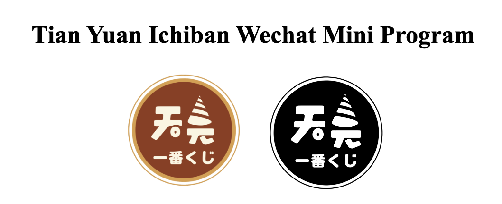
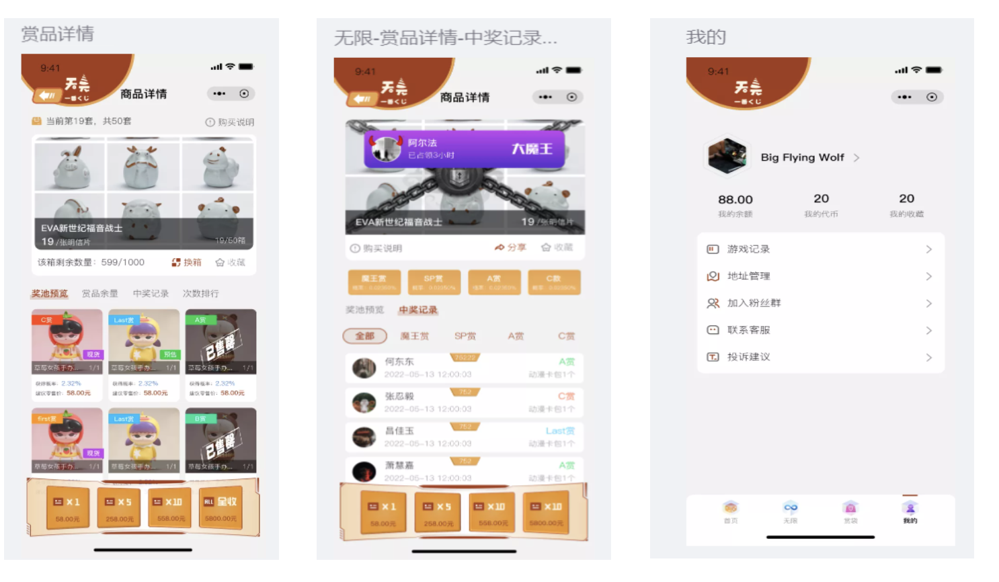
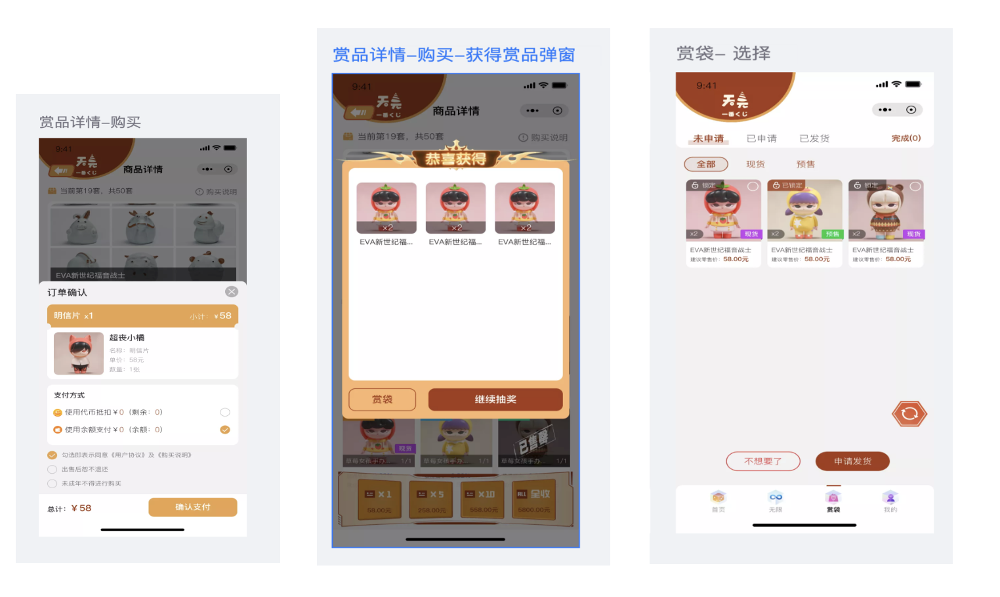
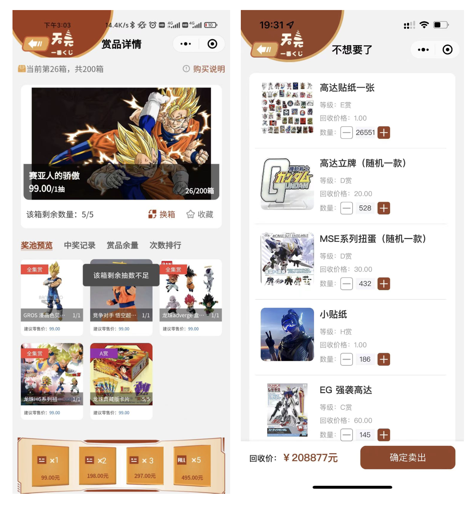
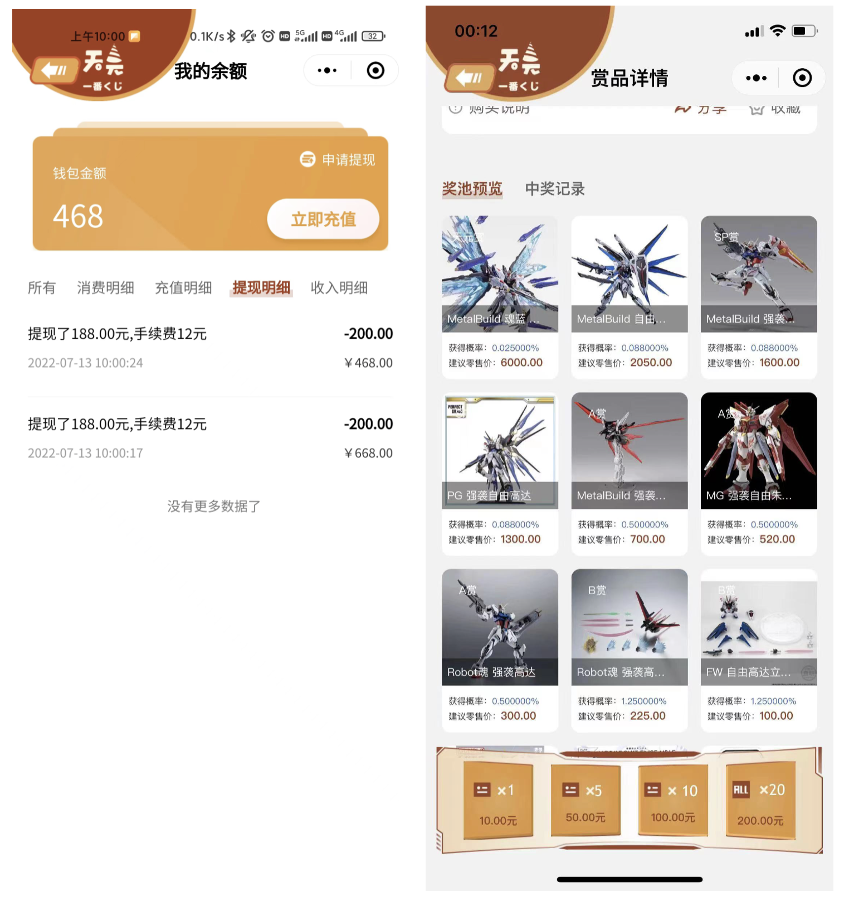
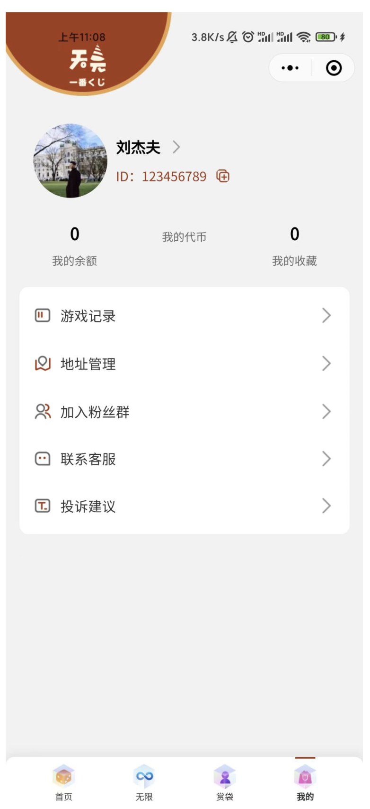

# Tian Yuan Ichiban Lookback

## Overview

The **Tian Yuan Ichiban** WeChat Mini Program was launched in the summer of 2022 and went offline in the spring of 2023. This document was compiled at the end of 2024 to serve as a project display.

Due to the project closure and team disbandment, many files were not retained. The images included are past screenshots.

## Contents

1. Requirements Document
2. Program Interface
3. Operation Summary

---

## 1. Requirements Document

### Overview
This is a **blind box lottery mini-program**, primarily offering ACG figurines as prizes.

### System Modules

#### User Side (Mini Program)
- **Login**: Users log in through WeChat authorization.
- **Homepage**:
  - **Banner Rotation**: Display of promotional images.
  - **Lottery Categories**:
    - Four categories per row, scrollable left/right.
    - Customizable backend categories.
  - **Sorting Options**:
    - Sort by **launch date** (ascending/descending).
    - Sort by **price** (low to high or high to low).
  - **Product Display**:
    - Two products per row with corresponding images.
    - Display includes product name, price, remaining stock.
  - **Navigation Buttons**:
    - Home, Infinite Draw, Reward Bag, My Profile (each with respective icons).

#### Lottery Mechanics
- **Dual Random Mode**:
  - Randomly triggers **two additional draws** during the event.
  - Special rewards like **First Prize** and **Last Prize**:
    - First Prize: Awarded within the first half of total draws.
    - Last Prize: Awarded within the final half.

- **Boxing Mode**:
  - Each lottery round consists of 5 draws.
  - Guaranteed **one standard prize per draw**.
  - After all five draws, additional **full collection prizes** are randomly awarded.

#### Blind Box Detail Page
- Displays background, name, cover image.
- Users can:
  - **Favorite** a box.
  - **See remaining stock**.
  - **Switch boxes**.
  - **Read rules and prize details**.
  - **Share with WeChat friends**.
  - **View draw pool preview, prize availability, draw history, and ranking**.
  - **Purchase options**: Single draw, five draws, ten draws, or full box purchase.

#### Purchase Page
- Users confirm order details:
  - Box name, quantity, unit price, payment method (WeChat Pay or balance).
  - Must agree to **Terms of Service** before payment.

#### Infinite Draw Mode
- Allows continuous participation in lotteries.
- Includes **"Demon King" Prize**, which rewards 0.88% of revenue to the latest winner.
- Users can:
  - View draw probabilities.
  - Check draw history and rankings.
  - Purchase draws in sets of 1, 5, or 10.

#### Reward Bag
- Users can:
  - View prizes categorized as **Not Claimed, Claimed, or Shipped**.
  - **Lock/unlock prizes** for security.
  - Choose to **sell back** unwanted prizes for balance credit.
  - **Request shipping** by entering delivery details.

#### User Profile
- Includes:
  - Profile picture, nickname.
  - **Balance & Tokens**:
    - Tokens are earned through promotions and cannot be withdrawn.
  - **Recharge & Withdrawals**:
    - Minimum recharge: ¥1 via WeChat Pay.
    - Withdrawals require account setup and admin approval.
  - **Game Records**: View past lottery results.
  - **Address Management**.
  - **Customer Service & Feedback**.

---

## 2. Program Interface

### Main Interfaces
**Home Page & Lottery Page**

**Reward Bag & Prize Details**

**Balance & Draw History**

**User Profile**

### Admin Panel (Backend)
- **Banner Management**
- **Category Management**
- **Prize Management**
  - Set prize amounts, recovery prices, names, and images.
- **Lottery Rules Management**
- **Order Management**
  - View user orders, handle refunds, process shipments.
- **User Management**
  - View all registered users.
- **Probability Adjustments**
  - Set and adjust draw probabilities.

---

## 3. Operation Summary

- **Launched**: Summer 2022
- **Offline**: Spring 2023
- **Revenue**: Approx. ¥100,000

### Challenges & Key Takeaways
- **Team & Competition**:
  - The team consisted of **part-time members**, and managing work responsibilities along with this project became difficult.
  - Increasing **market competition**, including **malicious actions from competitors**, impacted growth.
  - Iteration speed lagged behind competitors, with updates **once per week**.

- **Learning Experience**:
  - This was my **first product management** experience.
  - I participated in **requirement gathering, legal compliance, developer coordination, marketing, and user acquisition**.
  - The project **highlighted the importance of commercialization**, internal team collaboration, and execution.

### Reflections
- The project reinforced my commitment to **lifelong learning and entrepreneurship**.
- Understanding **market strategy, research, commercialization, and management** is critical for building a successful product.

---

This concludes the **Tian Yuan Ichiban Lookback**.
