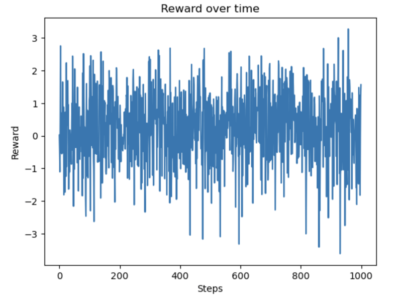
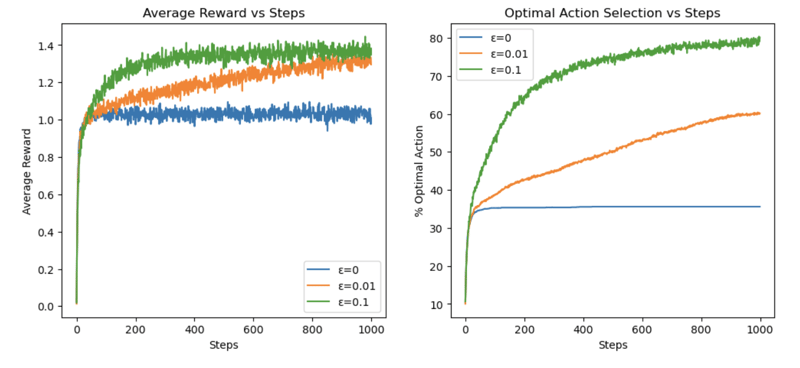

# 10-Armed Bandit Experiment for finding the best episilon

## Bandit Testbed

- A **10-armed bandit** where each arm's reward follows a **normal distribution**:
  
  $$
  R(a) \sim \mathcal{N}(q^*(a), 1)
  $$

  Where:
  - $ q^*(a) $ is the **true expected reward** of arm $ a $ (randomly sampled from $ \mathcal{N}(0,1) $).
  - The goal is to **maximize cumulative rewards** by finding the optimal arm $ a^* $.


---

## **Agent – Reinforcement Learning Strategy**

### **ε-Greedy Strategy**
- **Exploration**: With probability **ε**, the agent **randomly selects an arm**.
- **Exploitation**: With probability $ (1 - \epsilon) $, the agent **chooses the arm with the highest current Q-value**.

### **Incremental Q-Value Update**
- Uses **Incremental Sample Averaging** formula:

  $$
  Q_{n+1}(a) = Q_n(a) + \alpha \cdot (R_n - Q_n(a))
  $$

  Where:
  - $ Q_n(a) $ is the current estimate of arm $ a $.
  - $ R_n $ is the received reward.
  - $ \alpha = \frac{1}{n} $ is the learning rate (decreasing over time).

---

## **3. Single Experiment Analysis (1000 Steps)**

- Runs for **1000 steps**, observing **Q-value convergence**.
- Records:
  - **Reward at each step**.
  - **Number of times the agent selects the optimal action**.

### **Implementation Code:**
```python
import numpy as np
import matplotlib.pyplot as plt

class Bandit:
    def __init__(self, num_arms=10):
        self.q_star = np.random.normal(0, 1, num_arms)  # True values

    def get_reward(self, action):
        return np.random.normal(self.q_star[action], 1)

    def optimal_action(self):
        return np.argmax(self.q_star)

class Agent:
    def __init__(self, num_arms=10, epsilon=0.1):
        self.epsilon = epsilon
        self.q_estimates = np.zeros(num_arms)
        self.action_counts = np.zeros(num_arms)

    def select_action(self):
        if np.random.rand() < self.epsilon:
            return np.random.randint(len(self.q_estimates))
        return np.argmax(self.q_estimates)

    def update(self, action, reward):
        self.action_counts[action] += 1
        alpha = 1 / self.action_counts[action]
        self.q_estimates[action] += alpha * (reward - self.q_estimates[action])

# Run a single experiment
num_steps = 1000
bandit = Bandit()
agent = Agent(epsilon=0.1)

rewards = []
optimal_action_counts = []

for step in range(num_steps):
    action = agent.select_action()
    reward = bandit.get_reward(action)
    agent.update(action, reward)

    rewards.append(reward)
    optimal_action_counts.append(action == bandit.optimal_action())

plt.plot(rewards)
plt.xlabel("Steps")
plt.ylabel("Reward")
plt.title("Reward over time")
plt.show()
```


---

## **4. 2000 Experiments – Comparing Different \(ε\) Values**

### **Comparison of Different \(ε\) Values**
- **ε=0 (Pure Exploitation)**: Always selects the current best arm but risks early misjudgment.
- **ε=0.01 (Mild Exploration)**: Allows limited exploration, helping correct early mistakes.
- **ε=0.1 (More Exploration)**: Avoids local optima but may affect short-term rewards.

### **Analysis Content**
- **2000 experiments** are conducted to analyze:
  1. **Changes in average reward over time for different ε values**.
  2. **Changes in the percentage of selecting the optimal action over time**.

```python
num_experiments = 2000
epsilons = [0, 0.01, 0.1]
num_arms = 10

avg_rewards = {eps: np.zeros(num_steps) for eps in epsilons}
optimal_action_pct = {eps: np.zeros(num_steps) for eps in epsilons}

for experiment in range(num_experiments):
    bandit = Bandit()

    for eps in epsilons:
        agent = Agent(num_arms=num_arms, epsilon=eps)
        optimal_action = bandit.optimal_action()

        for step in range(num_steps):
            action = agent.select_action()
            reward = bandit.get_reward(action)
            agent.update(action, reward)

            avg_rewards[eps][step] += reward
            optimal_action_pct[eps][step] += (action == optimal_action)

for eps in epsilons:
    avg_rewards[eps] /= num_experiments
    optimal_action_pct[eps] = (optimal_action_pct[eps] / num_experiments) * 100

plt.figure(figsize=(12, 5))

plt.subplot(1, 2, 1)
for eps in epsilons:
    plt.plot(avg_rewards[eps], label=f'ε={eps}')
plt.xlabel("Steps")
plt.ylabel("Average Reward")
plt.legend()
plt.title("Average Reward vs Steps")

plt.subplot(1, 2, 2)
for eps in epsilons:
    plt.plot(optimal_action_pct[eps], label=f'ε={eps}')
plt.xlabel("Steps")
plt.ylabel("% Optimal Action")
plt.legend()
plt.title("Optimal Action Selection vs Steps")

plt.show()
```


---

## **5. Results Summary**

### **Key Conclusions**
- **ε=0.1 performs best in the long run**:
  - Initially suffers from exploration losses, but **better approximates the optimal strategy** in the long term.
- **ε=0 risks being stuck in local optima**:
  - Without exploration, early selection errors cannot be corrected.
- **ε=0.01 shows moderate performance**:
  - Balances exploration and exploitation but **takes longer to stabilize**.

---

## **6. Further Optimization**

### **Improving the Experimental Environment**
- **Introducing Non-Stationary Bandits**: Allowing $ q^*(a) $ to **change over time**, simulating a more complex environment.


### **Introducing Better Strategies**
- **UCB (Upper Confidence Bound)**: **Mathematically balances exploration and exploitation**.
- **Gradient Bandit**: **Uses gradient-based methods for better action selection**.
- **Thompson Sampling**: **Utilizes Bayesian inference for decision-making**.

---

## **Conclusion**

- **Exploration-Exploitation Tradeoff** in **Reinforcement Learning**.
- **ε-greedy Strategy** and its effectiveness.
- **Online Learning Framework** for sequential decision-making.
- **Comparing different ε strategies**.

---