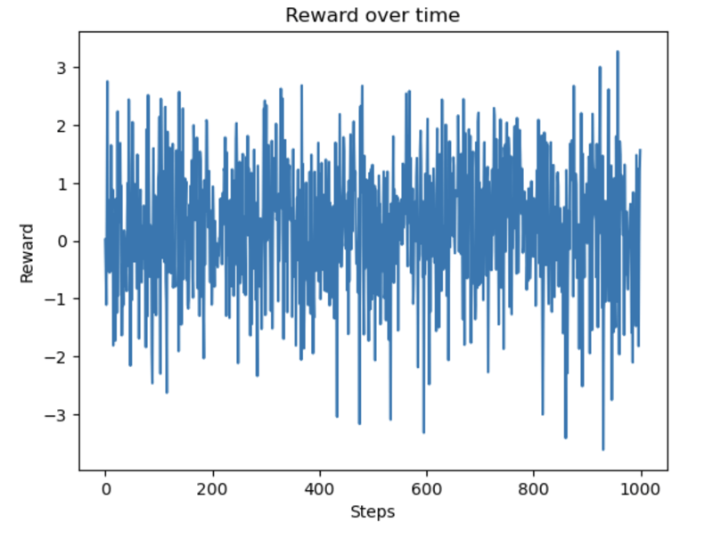
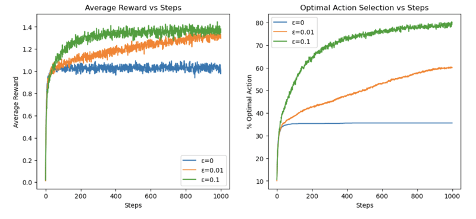

# 10-Armed Bandit Experiment

## Bandit Testbed

### 定义问题：
- 设定一个具有 **10 个拉杆（arms）** 的赌博机，每个拉杆的奖励分布是 **正态分布**：
  
  $$
  R(a) \sim \mathcal{N}(q^*(a), 1)
  $$

  其中：
  - \( q^*(a) \) 是该拉杆的 **真实期望奖励**（随机采样自 \( \mathcal{N}(0,1) \)）。
  - 目标是 **最大化累积奖励**，找到最优拉杆 \( a^* \)。

---

## 代理（Agent）—— 强化学习策略

### **ε-Greedy 策略**
- **探索（Exploration）**：以 ε 的概率 **随机选择一个拉杆**。
- **利用（Exploitation）**：以 \(1 - \epsilon\) 的概率，**选择当前 Q 值最高的拉杆**。

### **增量 Q 值更新**
- 采用 **增量平均公式（Incremental Sample Averaging）**：
  
  $$
  Q_{n+1}(a) = Q_n(a) + lpha \cdot (R_n - Q_n(a))
  $$

  其中：
  - \( Q_n(a) \) 是当前拉杆 \( a \) 的估计价值。
  - \( R_n \) 是当前的奖励。
  - \( lpha = rac{1}{n} \) 是学习率（随时间递减）。

---

## 3. 单次实验分析（1000 步）

- 运行 **1000 步**，观察 Q 值的收敛情况。
- 记录：
  - 每一步的 **奖励值**。
  - 代理 **选择最优动作（Optimal Action）** 的次数。

### 代码实现：
```python
import numpy as np
import matplotlib.pyplot as plt

class Bandit:
    def __init__(self, num_arms=10):
        self.q_star = np.random.normal(0, 1, num_arms)  # 真实价值

    def get_reward(self, action):
        return np.random.normal(self.q_star[action], 1)

    def optimal_action(self):
        return np.argmax(self.q_star)

class Agent:
    def __init__(self, num_arms=10, epsilon=0.1):
        self.epsilon = epsilon
        self.q_estimates = np.zeros(num_arms)
        self.action_counts = np.zeros(num_arms)

    def select_action(self):
        if np.random.rand() < self.epsilon:
            return np.random.randint(len(self.q_estimates))
        return np.argmax(self.q_estimates)

    def update(self, action, reward):
        self.action_counts[action] += 1
        alpha = 1 / self.action_counts[action]
        self.q_estimates[action] += alpha * (reward - self.q_estimates[action])

# 运行单次实验
num_steps = 1000
bandit = Bandit()
agent = Agent(epsilon=0.1)

rewards = []
optimal_action_counts = []

for step in range(num_steps):
    action = agent.select_action()
    reward = bandit.get_reward(action)
    agent.update(action, reward)

    rewards.append(reward)
    optimal_action_counts.append(action == bandit.optimal_action())

plt.plot(rewards)
plt.xlabel("Steps")
plt.ylabel("Reward")
plt.title("Reward over time")
plt.show()
```


---

## 4. 2000 轮实验，比较不同 ε 值的表现

### **不同 ε 值对比**
- **ε=0（纯利用）**：总是选择当前最优拉杆，但可能早期误判。
- **ε=0.01（少量探索）**：适度探索，能够纠正早期误判。
- **ε=0.1（较多探索）**：避免陷入局部最优，但可能影响短期收益。

### **分析内容**
- 通过 **2000 轮实验取平均**，分析：
  1. **不同 ε 的平均奖励随时间的变化**。
  2. **选择最优动作的概率随时间的变化**。

```python
num_experiments = 2000
epsilons = [0, 0.01, 0.1]
num_arms = 10

avg_rewards = {eps: np.zeros(num_steps) for eps in epsilons}
optimal_action_pct = {eps: np.zeros(num_steps) for eps in epsilons}

for experiment in range(num_experiments):
    bandit = Bandit()

    for eps in epsilons:
        agent = Agent(num_arms=num_arms, epsilon=eps)
        optimal_action = bandit.optimal_action()

        for step in range(num_steps):
            action = agent.select_action()
            reward = bandit.get_reward(action)
            agent.update(action, reward)

            avg_rewards[eps][step] += reward
            optimal_action_pct[eps][step] += (action == optimal_action)

for eps in epsilons:
    avg_rewards[eps] /= num_experiments
    optimal_action_pct[eps] = (optimal_action_pct[eps] / num_experiments) * 100

plt.figure(figsize=(12, 5))

plt.subplot(1, 2, 1)
for eps in epsilons:
    plt.plot(avg_rewards[eps], label=f'ε={eps}')
plt.xlabel("Steps")
plt.ylabel("Average Reward")
plt.legend()
plt.title("Average Reward vs Steps")

plt.subplot(1, 2, 2)
for eps in epsilons:
    plt.plot(optimal_action_pct[eps], label=f'ε={eps}')
plt.xlabel("Steps")
plt.ylabel("% Optimal Action")
plt.legend()
plt.title("Optimal Action Selection vs Steps")

plt.show()
```


---

## 5. 结果总结

### **主要结论**
- **ε=0.1** 在长期表现最好：
  - 初期会有一定的探索损失，但长期来看，能够更好地逼近真实的最优策略。
- **ε=0** 容易陷入局部最优：
  - 由于完全不探索，一旦早期误选最优拉杆，就很难修正。
- **ε=0.01** 表现适中：
  - 适度探索，能够找到最优拉杆，但需要更长的时间来达到稳定状态。

---

## 6. 进一步的优化

### **改进实验环境**
- **增加非静态赌博机**：让 \( q^*(a) \) **随时间变化**，模拟更复杂的环境。

### **引入更优策略**
- **UCB（Upper Confidence Bound）**：**平衡探索和利用**。
- **Gradient Bandit**：**使用梯度方法优化选择**。
- **Thompson Sampling**：**基于贝叶斯推理进行决策**。

---

## 总结

- **探索-利用权衡（Exploration-Exploitation Tradeoff）**
- **强化学习中的 ε-greedy 策略**
- **在线决策（Online Learning）** 框架
- **不同 ε 值策略对比**

这篇文章介绍了 **10-臂赌博机问题**，并通过实验验证了不同强化学习策略的效果。你可以用它作为**强化学习基础的复习材料**，也可以继续深入研究更复杂的 **Bandit 问题** 和 **深度强化学习（Deep RL）**。
