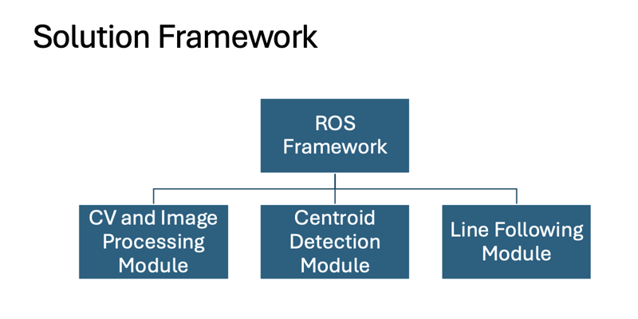
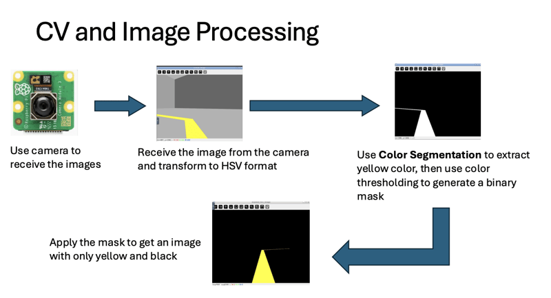
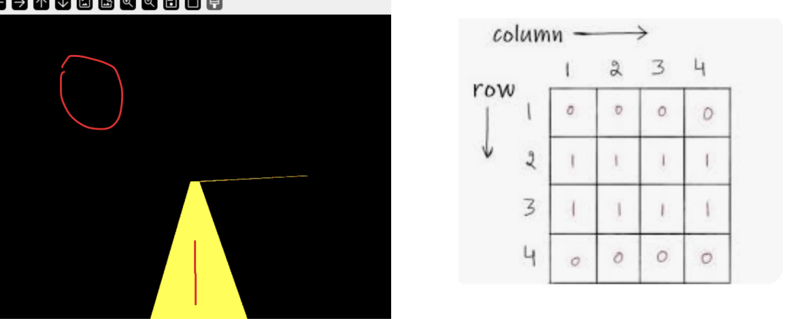
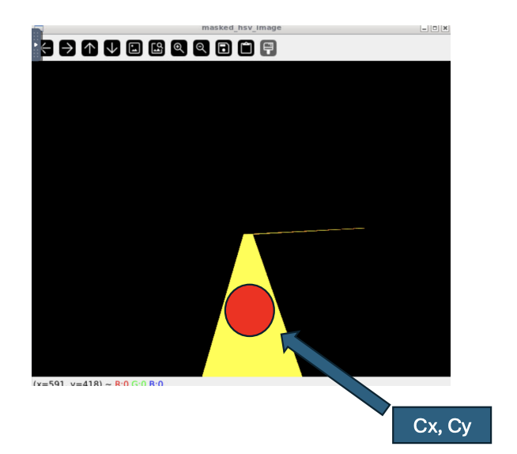
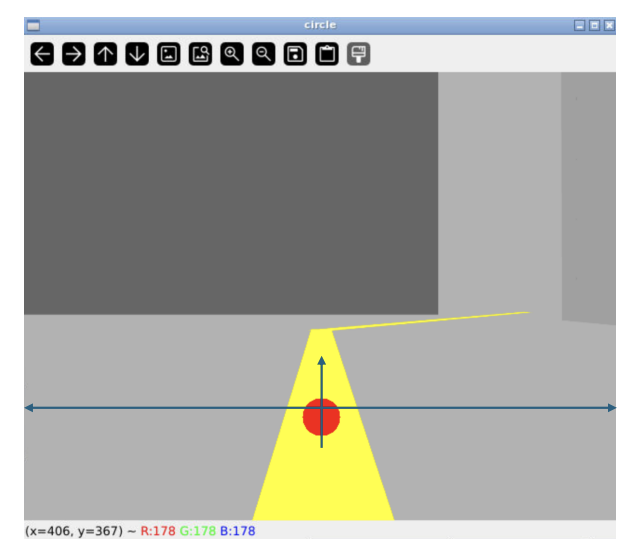
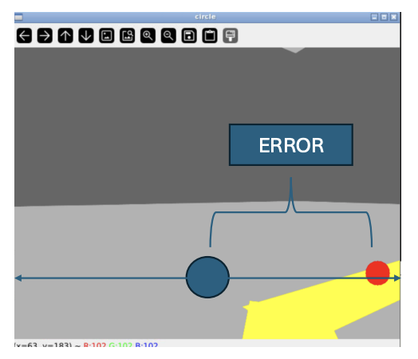

# Following Line based on Centroid Detection
This is a simple solution for line following tasks.

---

## 1. Solution Introduction
### Key implementation points:
- **Objective**: Enable autonomous line following for the robot.
- **Core concept**: Detect and create a "ball" in the line for the robot to follow - this is **Centroid Detection**.
- **Technical implementation**: Color-based recognition using **OpenCV** for image processing.
- **Special features**: Includes **obstacle avoidance** and other special condition handling.

---

## 2. Solution Framework and Process




---

## 3. Centroid Detection Principle

### 3.1 Binary Processing
- The image contains only **yellow and black** colors.
- Convert image to binary: **black = 0**, **yellow = 1**.
- Binary processing facilitates subsequent mathematical calculations.



### 3.2 Image Moment Calculation
In the yellow area, calculate the following:

#### Formula:
- **Zero-order moment** $ M_{00} $: Represents the total area.
- **First-order moments** $ M_{10}, M_{01} $: Weighted sums along x and y axes.

$$
M_{00} = \sum \sum I(x,y)
$$

$$
M_{10} = \sum \sum x \cdot I(x,y)
$$

$$
M_{01} = \sum \sum y \cdot I(x,y)
$$

### 3.3 Centroid Coordinate Calculation
Using the calculated moments, we can obtain the **centroid coordinates** $ (c_x, c_y) $ of the yellow area:

$$
c_x = \frac{M_{10}}{M_{00}}
$$

$$
c_y = \frac{M_{01}}{M_{00}}
$$





---

## 4. Motion Control Implementation

### 4.1 Error Calculation
To ensure accurate line following, calculate the error between the centroid and image center:

$$
error = c_x - \frac{width}{2}
$$

Where:
- $ c_x $ : detected centroid x-coordinate.
- $ width $ : image width.
- $ error $ : deviation from center.



### 4.2 P Controller
Based on practical testing, using only a **P controller** achieves good control results:

$$ \text{angular}_{\text{speed}} = - K_p \cdot \text{error} $$


#### Notes:
- Simple **P control** is used instead of full **PID control**.
- Testing showed **P control alone works better** in this scenario.
- Robot response sensitivity can be adjusted through $ K_p $ value.

---

## 5. Multi-State Decision Implementation

### 5.1 State Definitions
The system defines three basic states:
1. **State1 (line)**: Yellow line detection state.
2. **State2 (obstacle)**: Obstacle detection state.
3. **State3 (explore)**: Exploration state.

### 5.2 State Transition Logic
```python
if detect_line():
    # Line detected, follow centroid using P control
    follow_centroid()
elif not (detect_line() or detect_obstacle() or is_exploring):
    # No line detected and not exploring, rotate to search
    rotate_search()
    if search_timeout():
        set_explore_mode(True)
elif not (detect_line() or detect_obstacle()) and is_exploring:
    # Exploration mode, move forward to find target
    move_forward()
else:
    # Obstacle encountered, use left-hand rule for avoidance
    left_wall_follower()
```

---

## 6. System Limitations and Future Work

### 6.1 Current Limitations

#### **Color Recognition Limitations**
- Only supports **specific color line** detection.
- Challenges with **multi-colored lines** or actual roads.

#### **Obstacle Avoidance Constraints**
- May **lose original line** during avoidance.
- Lacks **line memory** and **relocation capabilities**.

### 6.2 Future Improvements
- Introduce **deep learning methods** to enhance line recognition.
- Integrate **machine learning algorithms** to optimize decision system.
- Add **reinforcement learning** for smarter path planning.
- Develop **more reliable line detection and following algorithms**.

---
