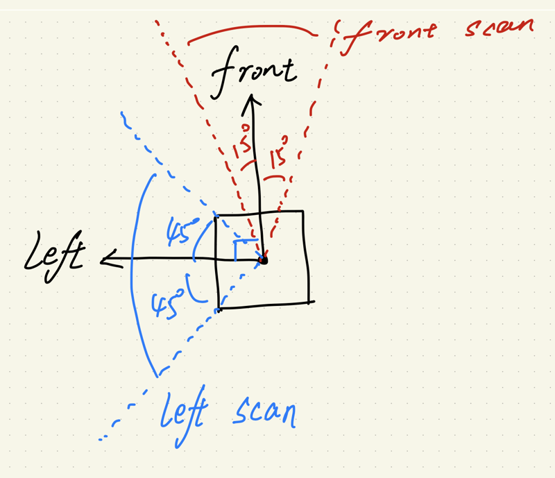
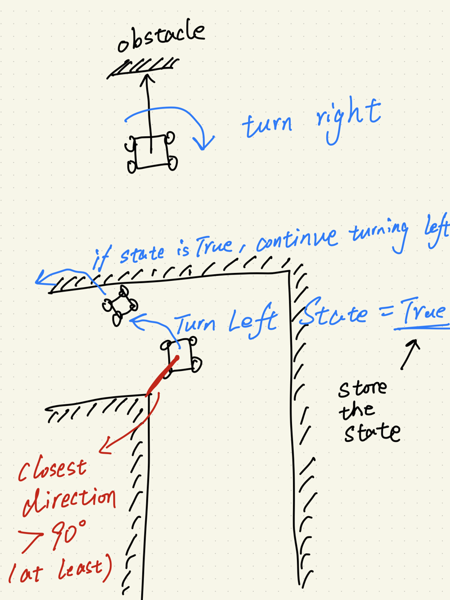
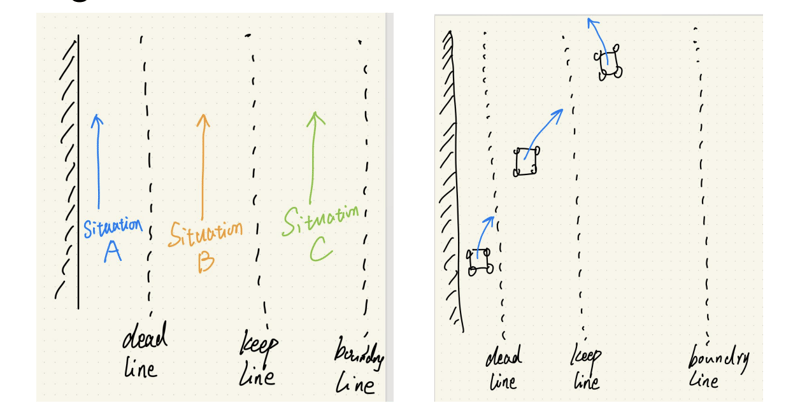

# A Simple Solution to Escape Maze

## Left Wall Following Algorithm

The **Left Wall Following Algorithm** is a simple yet effective approach for maze navigation. While it does not guarantee the shortest path, it ensures a successful exit in almost **100% of test cases**.




## Sensor-Based Approach

The robot makes decisions based on two key sensor readings:

1. **Front scan (-15° to 15°):** Detects obstacles directly in front.
2. **Left side scan (45° to 135°):** Measures the closest distance to the left wall.

## Algorithm Logic

### **1. Obstacle Detection**
- **If an obstacle is in front:**
  - If `left-turn state == True`, **turn left**.
  - Otherwise, **turn right**.

### **2. Path Navigation**
- **If no obstacle ahead:**
  - If in the **dead zone**, **turn right**.
  - If between the **dead line** and **keep line**, **move toward the keep line**.
  - If between the **keep line** and **boundary line**, **maintain position**.
  - If **outside the boundary line**, move straight until a **left wall is detected**.



## Code Structure

```python
class LeftWallFollower:
    def __init__(self):
        # Initialization logic here
        pass

    def clst_dtc_and_dir(self, start_degree, end_degree):
        """Detects the closest wall and its direction"""
        pass

    def scan_cb(self, msg):
        """Processes sensor scan data"""
        pass

    def follow_left_wall(self):
        """Implements velocity control and Bang-Bang Control logic"""
        pass
```

## Test Results

The algorithm was tested **10 times** in different maze positions, yielding a **100% success rate**:

- **Perfect route:** ✅ 60% of cases.
- **Imperfect route:** ⚠️ 40% of cases (**still successfully escaped**).

## Fault Tolerance

Two **fault cases** were observed:

1. **Dead-end handling:**  
   - If the robot **turns left into a dead-end**, it resets its state when encountering a new wall.
   
2. **Exit room misinterpretation:**  
   - The robot **may bypass a small room at the exit** due to sensor inaccuracy.



## Conclusion

The **Left Wall Follower Algorithm** is an effective solution for **autonomous robotic navigation**. Future enhancements could include:
- **PID-based control** for smoother motion.  
- **SLAM integration** for dynamic mapping.  
- **Machine learning enhancements** for improved adaptability.  

---