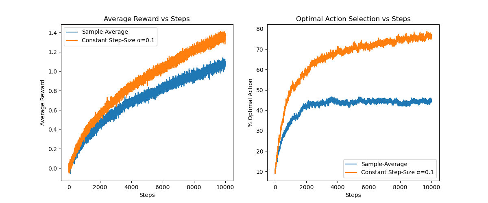
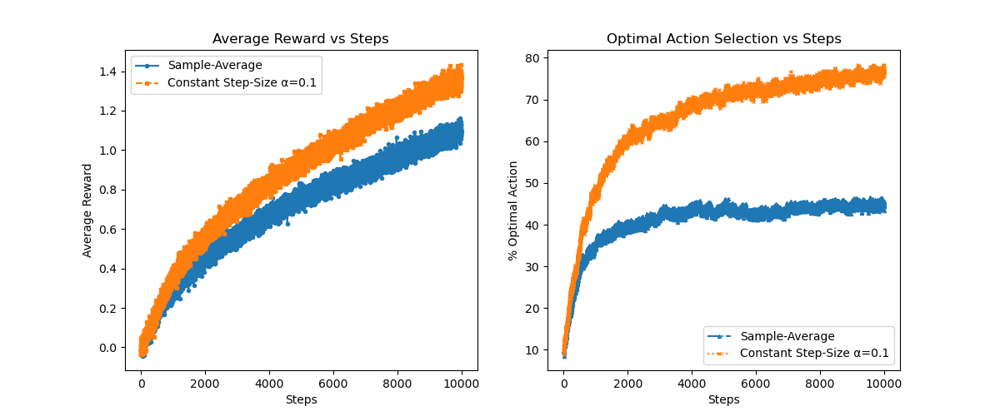
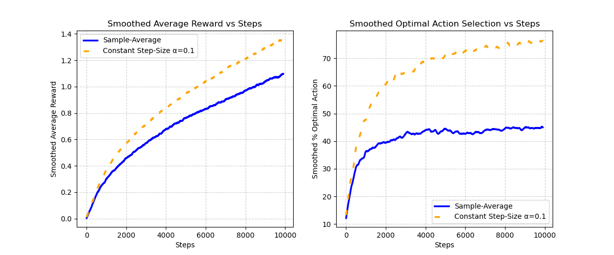
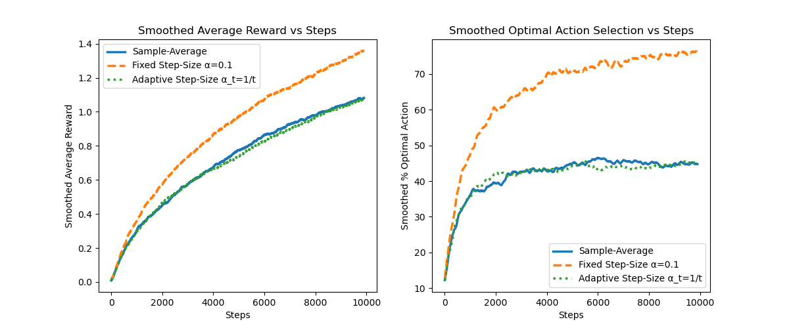
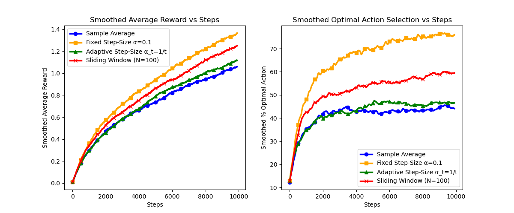
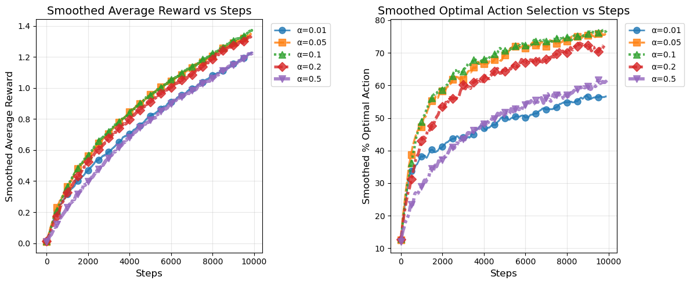

# Evaluating Q-Estimates in Nonstationary Bandit Environments

## Introduction

In this research, it is aimed to design and conduct an experiment that demonstrates the limitations of the sample-average method in nonstationary problems.

Previously, in the 10-arm bandit experiment, the true action values $ q_*(a) $ were sampled once from a $ \mathcal{N}(0, 1) $ distribution and kept fixed. I replicate the experiment to explore the performance of the $ \epsilon $-greedy strategy under three different $ \epsilon $ values for 1000 steps. After replicating the experiment (`Source Code: Experiment2-2`), I obtained a result consistent with the textbook, as shown in Figure 1.



This experiment indicated that $ \epsilon = 0.1 $ is optimal among the three settings. Building on this, I am interested in investigating a new question:
**If the environment is nonstationary, how do different $ Q $-estimation methods perform?**

With the proven optimal $ \epsilon = 0.1 $, I will extend the number of steps and create a nonstationary testbed to examine:

- The **sample-average method** (incremental update)
- The **constant step-size method**

The expectation, based on theoretical knowledge, is that the constant step-size method will adapt more quickly to changes in $ q_*(a) $ and thus perform better in a nonstationary environment.

---

## Experiment Setup (Testbed)

Before comparing, let's recall the methods that we have learned.

### Sample-Average Method

This method stores all historical rewards to compute the mean:

$$
Q(a) = \frac{1}{N(a)} \sum_{i=1}^{N(a)} R_i,
$$

We also use the **incremental form**, which is equivalent in result to the sample-average but more computationally efficient:

$$
Q(a) \leftarrow Q(a) + \frac{1}{N(a)} \bigl(R - Q(a)\bigr).
$$

### Constant Step-Size Method

In this method, we set $ \alpha = 0.1 $. This method places more weight on recent data and is expected to adapt more quickly in a nonstationary setting:

$$
Q(a) \leftarrow Q(a) + \alpha \bigl(R - Q(a)\bigr).
$$

We use the **incremental form of Sample-Average Method** and the **Constant Step-Size Method** to continue testing.

---

## Bandit Environment Setup

- **Initial values** of $ q_*(a) $: All arms start with the same initial $ q_*(a) $, which can be set to zero or another constant.
- **Random Walk**: At each step, all $ q^*(a) $ undergo a random walk:

  $$
  q^*(a) \leftarrow q^*(a) + \mathcal{N}(0, 0.01).
  $$
- **Reward**: When the agent selects an action $ a $, the reward $ R $ is drawn from:

  $$
  R \sim \mathcal{N}(q^*(a), 1).
  $$

---

## Agent Setup

- $ \epsilon $-greedy with $ \epsilon = 0.1 $.
- Compare:
  1. Sample-Average (incremental form)
  2. Constant Step-Size ($ \alpha = 0.1 $)

---

## Experiment Procedure

- Each experiment runs for **10,000 steps**.
- The experiment runs **2,000 independent trials** and then averages the results.
- The experiment records:
  1. The **average reward** at each step (to plot the reward curve).
  2. The **proportion of choosing the optimal action** at each step (to plot the optimal action percentage curve).

Based on theoretical reasoning, constant step-size is expected to adapt faster to changes in $ q^*(a) $ and demonstrate better performance in both the reward curve and the optimal action selection curve.

---

## Experimental Results

According to the above experimental setup, the result implemented by the codes is shown in Figure 2.



Since the raw lines are difficult to distinguish, I employed a **smoothed (moving average) approach** to highlight overall trends, shown in Figure 3.



### Observations:

- **Smoothed Average Reward vs. Steps (Left Subplot)**:

  - The orange dashed line (**Constant Step-Size $ \alpha=0.1 $**) achieves **higher reward** and continues to improve over time.
  - The blue solid line (**Sample-Average**) grows **more slowly** and converges to a **lower final value**.
  - **Conclusion**: Constant step-size ($ \alpha=0.1 $) adapts more quickly in the nonstationary environment, leading to higher average reward.
- **Smoothed Optimal Action Selection vs. Steps (Right Subplot)**:

  - The **orange dashed line** (Constant Step-Size) has a **higher rate of optimal action selection**, stabilizing around **70%**.
  - The **blue solid line** (Sample-Average) stabilizes around **40%**.
  - **Conclusion**: Constant step-size ($ \alpha=0.1 $) effectively tracks changes in $ q^*(a) $, enabling the agent to select the optimal action more frequently.

---

## More Experiments

Although the experiment has shown that $ \alpha=0.1 $ works effectively in this setup, additional investigations can be pursued.

### Adaptive Step-Size

One idea is to let the step-size decrease over time:

$$
Q_{t+1} = Q_t + \frac{1}{t}(R_t - Q_t).
$$

However, in nonstationary environments, if $ \frac{1}{t} $ becomes too small, it can slow adaptation. Empirical results (Figure 4) show that this strategy might perform worse than the pure sample-average method.



### Sliding Window Average

Another approach is using a **fixed-size sliding window**:

$$
Q_t = \frac{1}{N} \sum_{i=t-N+1}^{t} R_i,
$$

or in incremental form,

$$
Q_t = Q_{t-1} + \frac{1}{N} \Bigl( R_t - R_{t-N} \Bigr).
$$

Experiments (Figure 5) show that the sliding window average improves upon the pure sample-average but still underperforms compared to a properly chosen constant step-size.



### Choosing the Best $ \alpha $

Exploring different $ \alpha $ values (e.g., 0.05, 0.2, 0.5) to see how different step-sizes affect performance. Figure 6 shows the performance of different $ \alpha $ values: $ [0.01, 0.05, 0.1, 0.2, 0.5] $.

 \alpha  \alpha " />

Indeed, $ \alpha = 0.1 $ strikes a good balance between adaptation and noise smoothing in our testbed.

---

## Conclusion

- **Sample-average methods** work well for **stationary** environments but struggle in **nonstationary** settings.
- **Constant step-size methods** adapt to changes in $ q^*(a) $, leading to **higher rewards** and **better optimal-action selection rates**.
- The choice of $ \alpha $ is **crucial**:
  - **Too large** → High variance (sensitive to noise).
  - **Too small** → Slow adaptation.
  - **Empirical best**: $ \alpha=0.1 $.

This experiment confirms that the **constant step-size method** is the best choice for **nonstationary bandit problems**.

---

## Source Codes

### Experiment 2-2

   - Implements a 10-armed bandit problem with a stationary reward distribution.  
   - Compares **sample averaging** and **fixed step-size (α=0.1)** methods.  
   - Generates reward and optimal action selection plots.

```python
import numpy as np
import matplotlib.pyplot as plt
from tqdm import tqdm  # Progress bar, can be removed if not installed (see comments below)

class Bandit:
    def __init__(self, num_arms=10):
        # The true q*(a) values are sampled from N(0,1)
        self.q_star = np.random.normal(0, 1, num_arms)
    
    def get_reward(self, action):
        # The reward for an action is sampled from N(q*(a),1)
        return np.random.normal(self.q_star[action], 1)
    
    def optimal_action(self):
        # Returns the action with the highest true q*(a) value
        return np.argmax(self.q_star)

class Agent:
    def __init__(self, num_arms=10, epsilon=0.1):
        self.epsilon = epsilon
        self.q_estimates = np.zeros(num_arms)  # Initial Q values set to 0
        self.action_counts = np.zeros(num_arms)  # Track the number of times each action is taken
    
    def select_action(self):
        if np.random.rand() < self.epsilon:
            return np.random.randint(len(self.q_estimates))  # Random action (exploration)
        else:
            return np.argmax(self.q_estimates)  # Choose the action with the highest Q estimate (exploitation)
    
    def update(self, action, reward):
        self.action_counts[action] += 1
        alpha = 1 / self.action_counts[action]  # Sample-average update rule
        self.q_estimates[action] += alpha * (reward - self.q_estimates[action])

num_steps = 1000
bandit = Bandit()
agent = Agent(epsilon=0.1)

rewards = []
optimal_action_counts = []

for step in range(num_steps):
    action = agent.select_action()
    reward = bandit.get_reward(action)
    agent.update(action, reward)

    rewards.append(reward)
    optimal_action_counts.append(action == bandit.optimal_action())

print("Final Q estimates:", agent.q_estimates)
print("True q* values:", bandit.q_star)

print("tst bbb")

plt.plot(rewards)
plt.xlabel("Steps")
plt.ylabel("Reward")
plt.title("Reward over time")
plt.show(block=False)

print("test aaa")

num_experiments = 2000
epsilons = [0, 0.01, 0.1]
num_arms = 10

print("test running situation")

# Initialize data structures for storing results
avg_rewards = {eps: np.zeros(num_steps) for eps in epsilons}
optimal_action_pct = {eps: np.zeros(num_steps) for eps in epsilons}

# Use tqdm for progress bar, remove it if not needed (replace with "for _ in range(num_experiments):")
# for experiment in range(num_experiments):
# for _ in tqdm(range(num_experiments), desc="Running Experiments"):
for _ in tqdm(range(num_experiments), desc="Running Experiments", ascii=True):
    bandit = Bandit()  # Generate a new bandit problem instance
    
    for eps in epsilons:
        agent = Agent(num_arms=num_arms, epsilon=eps)
        optimal_action = bandit.optimal_action()

        for step in range(num_steps):
            action = agent.select_action()
            reward = bandit.get_reward(action)
            agent.update(action, reward)

            avg_rewards[eps][step] += reward
            optimal_action_pct[eps][step] += (action == optimal_action)

# Compute the final average over all experiments
for eps in epsilons:
    avg_rewards[eps] /= num_experiments
    optimal_action_pct[eps] = (optimal_action_pct[eps] / num_experiments) * 100

print("Finished 2000 experiments!")

# Plot results
plt.figure(figsize=(12, 5))

# Plot average reward over steps
plt.subplot(1, 2, 1)
for eps in epsilons:
    plt.plot(avg_rewards[eps], label=f'ε={eps}')
plt.xlabel("Steps")
plt.ylabel("Average Reward")
plt.legend()
plt.title("Average Reward vs Steps")

# Plot optimal action selection percentage over steps
plt.subplot(1, 2, 2)
for eps in epsilons:
    plt.plot(optimal_action_pct[eps], label=f'ε={eps}')
plt.xlabel("Steps")
plt.ylabel("% Optimal Action")
plt.legend()
plt.title("Optimal Action Selection vs Steps")

plt.show()
```

### Excersize 2-5

   - Extends the baseline to a **non-stationary environment** where Q-values drift over time.  
   - Compares **sample averaging, fixed step-size, and adaptive step-size (α_t = 1/t)**.  
   - Includes smoothed plots for better visualization.

```python
import numpy as np
import matplotlib.pyplot as plt
from tqdm import tqdm  # Progress bar, can be removed if not installed (see comments below)

# 10-armed bandit environment (with non-stationary setting)
class Bandit:
    def __init__(self, num_arms=10):
        self.num_arms = num_arms
        self.q_star = np.zeros(num_arms)  # Initialize all q*(a) to 0

    def get_reward(self, action):
        return np.random.normal(self.q_star[action], 1)  # Reward sampled from N(q*(a), 1)

    def update_q_star(self):
        """ Random walk for all q*(a) at each step """
        self.q_star += np.random.normal(0, 0.01, self.num_arms)

    def optimal_action(self):
        """ Returns the index of the arm with the highest q*(a) """
        return np.argmax(self.q_star)

# Agent (ε-greedy strategy, supports two Q estimation methods)
class Agent:
    def __init__(self, num_arms=10, epsilon=0.1, alpha=None):
        self.epsilon = epsilon
        self.alpha = alpha  # None means sample-average method, a fixed value represents α=0.1
        self.q_estimates = np.zeros(num_arms)  # Estimated Q values
        self.action_counts = np.zeros(num_arms)  # Track the count of each action taken

    def select_action(self):
        """ ε-greedy selection strategy """
        if np.random.rand() < self.epsilon:
            return np.random.randint(len(self.q_estimates))  # 10% exploration (random action)
        else:
            return np.argmax(self.q_estimates)  # 90% exploitation (choose best-known action)

    def update(self, action, reward):
        """ Update Q estimates """
        self.action_counts[action] += 1
        if self.alpha is None:  # Sample-average method
            alpha = 1 / self.action_counts[action]
        else:  # Fixed step-size α=0.1
            alpha = self.alpha
        self.q_estimates[action] += alpha * (reward - self.q_estimates[action])

# Run experiment
def run_experiment(num_steps=10000, num_experiments=2000, epsilon=0.1, alpha=None):
    avg_rewards = np.zeros(num_steps)
    optimal_action_pct = np.zeros(num_steps)

    # Use tqdm for progress bar, remove it if not needed (replace with "for _ in range(num_experiments):")
    for _ in tqdm(range(num_experiments), desc="Running Experiments"):
        bandit = Bandit()
        agent = Agent(epsilon=epsilon, alpha=alpha)
        optimal_action = bandit.optimal_action()

        for step in range(num_steps):
            action = agent.select_action()
            reward = bandit.get_reward(action)
            agent.update(action, reward)
            bandit.update_q_star()  # Apply random walk to q*(a)

            avg_rewards[step] += reward
            optimal_action_pct[step] += (action == bandit.optimal_action())

    avg_rewards /= num_experiments
    optimal_action_pct = (optimal_action_pct / num_experiments) * 100  # Convert to percentage
    return avg_rewards, optimal_action_pct

# Run experiment and compare the two Q estimation methods
num_steps = 10000
num_experiments = 2000
epsilon = 0.1

# Sample-average method
print("Sample Average - Incrementally Computed: ")
rewards_sample_avg, optimal_sample_avg = run_experiment(num_steps, num_experiments, epsilon, alpha=None)

# Fixed step-size α=0.1
print("Constant Step-Size: ")
rewards_const_alpha, optimal_const_alpha = run_experiment(num_steps, num_experiments, epsilon, alpha=0.1)

# Plot results
plt.figure(figsize=(12, 5))

# Average reward curve
plt.subplot(1, 2, 1)
plt.plot(rewards_sample_avg, linestyle="-", marker="o", markersize=3, linewidth=1.5, label='Sample-Average')
plt.plot(rewards_const_alpha, linestyle="--", marker="s", markersize=3, linewidth=1.5, label='Constant Step-Size α=0.1')
plt.xlabel("Steps")
plt.ylabel("Average Reward")
plt.legend()
plt.title("Average Reward vs Steps")

# Optimal action selection rate curve
plt.subplot(1, 2, 2)
plt.plot(optimal_sample_avg, linestyle="-.", marker="^", markersize=3, linewidth=1.5, label='Sample-Average')
plt.plot(optimal_const_alpha, linestyle=":", marker="x", markersize=3, linewidth=1.5, label='Constant Step-Size α=0.1')
plt.xlabel("Steps")
plt.ylabel("% Optimal Action")
plt.legend()
plt.title("Optimal Action Selection vs Steps")

plt.show()

## Since the above plots are difficult to distinguish using only points and lines, 
## we use a moving average to show the overall trend more clearly:

# **New Plots: Using Moving Average to Show a Smoother Trend**

# Compute moving average
def moving_average(data, window_size=100):
    return np.convolve(data, np.ones(window_size)/window_size, mode='valid')

# Align x-axis
x_smooth = np.arange(len(moving_average(rewards_sample_avg)))

plt.figure(figsize=(12, 5))

# Smoothed average reward curve
plt.subplot(1, 2, 1)
plt.plot(x_smooth, moving_average(rewards_sample_avg), linestyle="-", linewidth=2.5, color="blue", label='Sample-Average')
plt.plot(x_smooth, moving_average(rewards_const_alpha), linestyle=":", linewidth=2.5, color="orange", label='Constant Step-Size α=0.1')
plt.gca().lines[-1].set_dashes((3, 6))  # Set dotted line with larger spacing
plt.xlabel("Steps")
plt.ylabel("Smoothed Average Reward")
plt.legend()
plt.title("Smoothed Average Reward vs Steps")
plt.grid(True, linestyle="--", alpha=0.6)  # Add grid lines

# Smoothed optimal action selection rate curve
plt.subplot(1, 2, 2)
plt.plot(x_smooth, moving_average(optimal_sample_avg), linestyle="-", linewidth=2.5, color="blue", label='Sample-Average')
plt.plot(x_smooth, moving_average(optimal_const_alpha), linestyle=":", linewidth=2.5, color="orange", label='Constant Step-Size α=0.1')
plt.gca().lines[-1].set_dashes((3, 6))  # Set dotted line with larger spacing
plt.xlabel("Steps")
plt.ylabel("Smoothed % Optimal Action")
plt.legend()
plt.title("Smoothed Optimal Action Selection vs Steps")
plt.grid(True, linestyle="--", alpha=0.6)  # Add grid lines

plt.show()
```

### Adaptive Experiment

   - Introduces a **sliding window approach** to handle non-stationary problems.  
   - Compares sample averaging, fixed step-size, adaptive step-size, and sliding window methods.

```python
import numpy as np
import matplotlib.pyplot as plt
from tqdm import tqdm  # Progress bar for visualization

# 10-armed bandit environment (non-stationary setting)
class Bandit:
    def __init__(self, num_arms=10):
        self.num_arms = num_arms
        self.q_star = np.zeros(num_arms)  # Initialize all q*(a) to 0

    def get_reward(self, action):
        return np.random.normal(self.q_star[action], 1)  # Reward sampled from N(q*(a), 1)

    def update_q_star(self):
        """ Perform random walk for all q*(a) at each step """
        self.q_star += np.random.normal(0, 0.01, self.num_arms)

    def optimal_action(self):
        """ Return the index of the arm with the highest q*(a) """
        return np.argmax(self.q_star)

# Agent (ε-greedy strategy, supports three Q estimation methods)
class Agent:
    def __init__(self, num_arms=10, epsilon=0.1, alpha=None, adaptive=False):
        self.epsilon = epsilon
        self.alpha = alpha  # None for sample-average method, fixed value for constant step-size
        self.adaptive = adaptive  # If True, uses adaptive step-size α_t = 1/t
        self.q_estimates = np.zeros(num_arms)  # Estimated Q values
        self.action_counts = np.zeros(num_arms)  # Track count of each action taken

    def select_action(self):
        """ ε-greedy action selection """
        if np.random.rand() < self.epsilon:
            return np.random.randint(len(self.q_estimates))  # 10% exploration (random action)
        else:
            return np.argmax(self.q_estimates)  # 90% exploitation (choose best-known action)

    def update(self, action, reward):
        """ Update Q estimates """
        self.action_counts[action] += 1
        if self.adaptive:  # Adaptive step-size α_t = 1/t
            alpha = 1 / self.action_counts[action]
        elif self.alpha is None:  # Sample-average method α_t = 1/N_t
            alpha = 1 / self.action_counts[action]
        else:  # Fixed step-size α = 0.1
            alpha = self.alpha
        self.q_estimates[action] += alpha * (reward - self.q_estimates[action])

# Run experiment
def run_experiment(num_steps=10000, num_experiments=2000, epsilon=0.1, alpha=None, adaptive=False):
    avg_rewards = np.zeros(num_steps)
    optimal_action_pct = np.zeros(num_steps)

    for _ in tqdm(range(num_experiments), desc="Running Experiments"):
        bandit = Bandit()
        agent = Agent(epsilon=epsilon, alpha=alpha, adaptive=adaptive)
        optimal_action = bandit.optimal_action()

        for step in range(num_steps):
            action = agent.select_action()
            reward = bandit.get_reward(action)
            agent.update(action, reward)
            bandit.update_q_star()  # Apply random walk to q*(a)

            avg_rewards[step] += reward
            optimal_action_pct[step] += (action == bandit.optimal_action())

    avg_rewards /= num_experiments
    optimal_action_pct = (optimal_action_pct / num_experiments) * 100  # Convert to percentage
    return avg_rewards, optimal_action_pct

# Run experiment and compare three Q estimation methods
num_steps = 10000
num_experiments = 2000
epsilon = 0.1

# 1️⃣ Sample-average method
print("Sample Average - Incrementally Computed: ")
rewards_sample_avg, optimal_sample_avg = run_experiment(num_steps, num_experiments, epsilon, alpha=None)

# 2️⃣ Fixed step-size α=0.1
print("Fixed Step-Size α=0.1: ")
rewards_const_alpha, optimal_const_alpha = run_experiment(num_steps, num_experiments, epsilon, alpha=0.1)

# 3️⃣ Adaptive step-size α_t = 1/t
print("Adaptive Step-Size α_t = 1/t: ")
rewards_adaptive, optimal_adaptive = run_experiment(num_steps, num_experiments, epsilon, adaptive=True)

# 🎨 **Plot results**
plt.figure(figsize=(12, 5))

# Average reward curve
plt.subplot(1, 2, 1)
plt.plot(rewards_sample_avg, linestyle="-", linewidth=1.5, label='Sample-Average')
plt.plot(rewards_const_alpha, linestyle="--", linewidth=1.5, label='Fixed Step-Size α=0.1')
plt.plot(rewards_adaptive, linestyle=":", linewidth=1.5, label='Adaptive Step-Size α_t=1/t')
plt.xlabel("Steps")
plt.ylabel("Average Reward")
plt.legend()
plt.title("Average Reward vs Steps")

# Optimal action selection rate curve
plt.subplot(1, 2, 2)
plt.plot(optimal_sample_avg, linestyle="-", linewidth=1.5, label='Sample-Average')
plt.plot(optimal_const_alpha, linestyle="--", linewidth=1.5, label='Fixed Step-Size α=0.1')
plt.plot(optimal_adaptive, linestyle=":", linewidth=1.5, label='Adaptive Step-Size α_t=1/t')
plt.xlabel("Steps")
plt.ylabel("% Optimal Action")
plt.legend()
plt.title("Optimal Action Selection vs Steps")

plt.show()

# **New Plots: Using Moving Average for a Smoother Trend**
def moving_average(data, window_size=100):
    return np.convolve(data, np.ones(window_size)/window_size, mode='valid')

x_smooth = np.arange(len(moving_average(rewards_sample_avg)))

plt.figure(figsize=(12, 5))

# Smoothed average reward curve
plt.subplot(1, 2, 1)
plt.plot(x_smooth, moving_average(rewards_sample_avg), linestyle="-", linewidth=2.5, label='Sample-Average')
plt.plot(x_smooth, moving_average(rewards_const_alpha), linestyle="--", linewidth=2.5, label='Fixed Step-Size α=0.1')
plt.plot(x_smooth, moving_average(rewards_adaptive), linestyle=":", linewidth=2.5, label='Adaptive Step-Size α_t=1/t')
plt.xlabel("Steps")
plt.ylabel("Smoothed Average Reward")
plt.legend()
plt.title("Smoothed Average Reward vs Steps")

# Smoothed optimal action selection rate curve
plt.subplot(1, 2, 2)
plt.plot(x_smooth, moving_average(optimal_sample_avg), linestyle="-", linewidth=2.5, label='Sample-Average')
plt.plot(x_smooth, moving_average(optimal_const_alpha), linestyle="--", linewidth=2.5, label='Fixed Step-Size α=0.1')
plt.plot(x_smooth, moving_average(optimal_adaptive), linestyle=":", linewidth=2.5, label='Adaptive Step-Size α_t=1/t')
plt.xlabel("Steps")
plt.ylabel("Smoothed % Optimal Action")
plt.legend()
plt.title("Smoothed Optimal Action Selection vs Steps")

plt.show()
```

### Sliding Window Experiment

   - Runs experiments for **different values of fixed step-size α** to find the optimal learning rate.  
   - Tests α = {0.01, 0.05, 0.1, 0.2, 0.5} and generates performance plots.

```python
import numpy as np
import matplotlib.pyplot as plt
from tqdm import tqdm  # Progress bar for visualization
from collections import deque  # Used for sliding window implementation

# 10-armed bandit environment (non-stationary setting)
class Bandit:
    def __init__(self, num_arms=10):
        self.num_arms = num_arms
        self.q_star = np.zeros(num_arms)  # Initialize all q*(a) to 0

    def get_reward(self, action):
        return np.random.normal(self.q_star[action], 1)  # Reward sampled from N(q*(a), 1)

    def update_q_star(self):
        """ Perform random walk for all q*(a) at each step """
        self.q_star += np.random.normal(0, 0.01, self.num_arms)

    def optimal_action(self):
        """ Return the index of the arm with the highest q*(a) """
        return np.argmax(self.q_star)


# Agent class with Sliding Window method
class Agent:
    def __init__(self, num_arms=10, epsilon=0.1, alpha=None, window_size=None):
        self.epsilon = epsilon
        self.alpha = alpha
        self.window_size = window_size
        self.q_estimates = np.zeros(num_arms)  # Estimated Q values
        self.action_counts = np.zeros(num_arms)  # Track count of each action taken
        self.reward_windows = [deque(maxlen=window_size) for _ in range(num_arms)] if window_size else None

    def select_action(self):
        """ ε-greedy action selection """
        if np.random.rand() < self.epsilon:
            return np.random.randint(len(self.q_estimates))  # 10% exploration (random action)
        else:
            return np.argmax(self.q_estimates)  # 90% exploitation (choose best-known action)

    def update(self, action, reward):
        """ Update Q estimates """
        self.action_counts[action] += 1

        if self.window_size:  # Sliding window update
            self.reward_windows[action].append(reward)
            self.q_estimates[action] = np.mean(self.reward_windows[action])
        elif self.alpha == "1/t":  # Adaptive step-size α_t = 1/t
            alpha = 1 / self.action_counts[action]
            self.q_estimates[action] += alpha * (reward - self.q_estimates[action])
        elif self.alpha is None:  # Sample-average method
            alpha = 1 / self.action_counts[action]
            self.q_estimates[action] += alpha * (reward - self.q_estimates[action])
        else:  # Fixed step-size α=0.1
            self.q_estimates[action] += self.alpha * (reward - self.q_estimates[action])


# Run experiment
def run_experiment(num_steps=10000, num_experiments=2000, epsilon=0.1, alpha=None, window_size=None):
    avg_rewards = np.zeros(num_steps)
    optimal_action_pct = np.zeros(num_steps)

    for _ in tqdm(range(num_experiments), desc="Running Experiments"):
        bandit = Bandit()
        agent = Agent(epsilon=epsilon, alpha=alpha, window_size=window_size)
        optimal_action = bandit.optimal_action()

        for step in range(num_steps):
            action = agent.select_action()
            reward = bandit.get_reward(action)
            agent.update(action, reward)
            bandit.update_q_star()  # Apply random walk to q*(a)

            avg_rewards[step] += reward
            optimal_action_pct[step] += (action == bandit.optimal_action())

    avg_rewards /= num_experiments
    optimal_action_pct = (optimal_action_pct / num_experiments) * 100  # Convert to percentage
    return avg_rewards, optimal_action_pct


# ** Run experiment**
num_steps = 10000
num_experiments = 2000
epsilon = 0.1

# Sample-average method
print("Sample Average - Incrementally Computed: ")
rewards_sample_avg, optimal_sample_avg = run_experiment(num_steps, num_experiments, epsilon, alpha=None)

# Fixed step-size α=0.1
print("Fixed Step-Size α=0.1: ")
rewards_const_alpha, optimal_const_alpha = run_experiment(num_steps, num_experiments, epsilon, alpha=0.1)

# Adaptive step-size α_t = 1/t
print("Adaptive Step-Size α_t = 1/t: ")
rewards_adaptive, optimal_adaptive = run_experiment(num_steps, num_experiments, epsilon, alpha="1/t")

# Sliding window (N=100)
print("Sliding Window (N=100):")
rewards_window, optimal_window = run_experiment(num_steps, num_experiments, epsilon, window_size=100)


# **Plot results**
plt.figure(figsize=(12, 5))

# **Average reward curve**
plt.subplot(1, 2, 1)
plt.plot(rewards_sample_avg, linestyle="-", linewidth=1.5, label='Sample-Average')
plt.plot(rewards_const_alpha, linestyle="--", linewidth=1.5, label='Fixed Step-Size α=0.1')
plt.plot(rewards_adaptive, linestyle=":", linewidth=1.5, label='Adaptive Step-Size α_t=1/t')
plt.plot(rewards_window, linestyle="-.", linewidth=1.5, label='Sliding Window (N=100)')
plt.xlabel("Steps")
plt.ylabel("Average Reward")
plt.legend()
plt.title("Average Reward vs Steps")

# **Optimal action selection rate curve**
plt.subplot(1, 2, 2)
plt.plot(optimal_sample_avg, linestyle="-", linewidth=1.5, label='Sample-Average')
plt.plot(optimal_const_alpha, linestyle="--", linewidth=1.5, label='Fixed Step-Size α=0.1')
plt.plot(optimal_adaptive, linestyle=":", linewidth=1.5, label='Adaptive Step-Size α_t=1/t')
plt.plot(optimal_window, linestyle="-.", linewidth=1.5, label='Sliding Window (N=100)')
plt.xlabel("Steps")
plt.ylabel("% Optimal Action")
plt.legend()
plt.title("Optimal Action Selection vs Steps")

plt.show()


# **New Plots: Using Moving Average for a Smoother Trend**
def moving_average(data, window_size=100):
    return np.convolve(data, np.ones(window_size)/window_size, mode='valid')

x_smooth = np.arange(len(moving_average(rewards_sample_avg)))

plt.figure(figsize=(12, 5))

markers = ["o", "s", "^", "x"] 
labels = [
    "Sample Average",
    "Fixed Step-Size α=0.1",
    "Adaptive Step-Size α_t=1/t",
    "Sliding Window (N=100)"
]
colors = ["blue", "orange", "green", "red"] 
data = [
    (rewards_sample_avg, optimal_sample_avg),
    (rewards_const_alpha, optimal_const_alpha),
    (rewards_adaptive, optimal_adaptive),
    (rewards_window, optimal_window)
]

# Smoothed average reward curve
plt.subplot(1, 2, 1)
for (rewards, _), marker, label, color in zip(data, markers, labels, colors):
    plt.plot(x_smooth, moving_average(rewards), marker=marker, markevery=500, linewidth=2.5, label=label, color=color)
plt.xlabel("Steps")
plt.ylabel("Smoothed Average Reward")
plt.legend()
plt.title("Smoothed Average Reward vs Steps")

# Smoothed optimal action selection rate curve
plt.subplot(1, 2, 2)
for (_, optimal), marker, label, color in zip(data, markers, labels, colors):
    plt.plot(x_smooth, moving_average(optimal), marker=marker, markevery=500, linewidth=2.5, label=label, color=color)
plt.xlabel("Steps")
plt.ylabel("Smoothed % Optimal Action")
plt.legend()
plt.title("Smoothed Optimal Action Selection vs Steps")

plt.show()
```

### Alpha

   - Generates **smoothed performance plots** for all tested methods.  
   - Uses moving average to reduce noise and improve trend visualization.

```python
import numpy as np
import matplotlib.pyplot as plt
from tqdm import tqdm  # Progress bar for visualization

# 10-armed bandit environment (non-stationary setting)
class Bandit:
    def __init__(self, num_arms=10):
        self.num_arms = num_arms
        self.q_star = np.zeros(num_arms)  # Initialize all q*(a) to 0

    def get_reward(self, action):
        return np.random.normal(self.q_star[action], 1)  # Reward sampled from N(q*(a), 1)

    def update_q_star(self):
        """ Perform a random walk for all q*(a) at each step """
        self.q_star += np.random.normal(0, 0.01, self.num_arms)

    def optimal_action(self):
        """ Return the index of the arm with the highest q*(a) """
        return np.argmax(self.q_star)


# Agent using a fixed step-size α
class Agent:
    def __init__(self, num_arms=10, epsilon=0.1, alpha=0.1):
        self.epsilon = epsilon
        self.alpha = alpha  # Fixed step-size α
        self.q_estimates = np.zeros(num_arms)  # Estimated Q values
        self.action_counts = np.zeros(num_arms)  # Track the count of each action taken

    def select_action(self):
        """ ε-greedy action selection strategy """
        if np.random.rand() < self.epsilon:
            return np.random.randint(len(self.q_estimates))  # 10% exploration (random action)
        else:
            return np.argmax(self.q_estimates)  # 90% exploitation (choose best-known action)

    def update(self, action, reward):
        """ Update Q estimates using a fixed step-size α """
        self.q_estimates[action] += self.alpha * (reward - self.q_estimates[action])


# Run the experiment
def run_experiment(num_steps=10000, num_experiments=2000, epsilon=0.1, alpha=0.1):
    avg_rewards = np.zeros(num_steps)
    optimal_action_pct = np.zeros(num_steps)

    for _ in tqdm(range(num_experiments), desc=f"Running α={alpha}"):
        bandit = Bandit()
        agent = Agent(epsilon=epsilon, alpha=alpha)
        
        for step in range(num_steps):
            action = agent.select_action()
            reward = bandit.get_reward(action)
            agent.update(action, reward)
            bandit.update_q_star()  # Apply random walk to q*(a)

            avg_rewards[step] += reward
            optimal_action_pct[step] += (action == bandit.optimal_action())

    avg_rewards /= num_experiments
    optimal_action_pct = (optimal_action_pct / num_experiments) * 100  # Convert to percentage
    return avg_rewards, optimal_action_pct


# Run the experiment for different α values
num_steps = 10000
num_experiments = 2000
epsilon = 0.1

alpha_values = [0.01, 0.05, 0.1, 0.2, 0.5]
rewards_dict = {}
optimal_dict = {}

for alpha in alpha_values:
    rewards_dict[alpha], optimal_dict[alpha] = run_experiment(num_steps, num_experiments, epsilon, alpha=alpha)

# **Plot results**
plt.figure(figsize=(12, 5))

# **Average reward curve**
plt.subplot(1, 2, 1)
for alpha in alpha_values:
    plt.plot(rewards_dict[alpha], linewidth=2, label=f'α={alpha}')
plt.xlabel("Steps")
plt.ylabel("Average Reward")
plt.legend()
plt.title("Average Reward vs Steps")

# **Optimal action selection rate curve**
plt.subplot(1, 2, 2)
for alpha in alpha_values:
    plt.plot(optimal_dict[alpha], linewidth=2, label=f'α={alpha}')
plt.xlabel("Steps")
plt.ylabel("% Optimal Action")
plt.legend()
plt.title("Optimal Action Selection vs Steps")

plt.show()


# Smooth results using moving average
def moving_average(data, window_size=100):
    return np.convolve(data, np.ones(window_size)/window_size, mode='valid')

x_smooth = np.arange(len(moving_average(next(iter(rewards_dict.values())))))

plt.figure(figsize=(12, 5))
plt.style.use('default')  # 使用默认样式替代seaborn

# Define line styles for better distinction
line_styles = [
    (0, ()), # solid
    (0, (5, 1)), # dashed
    (0, (1, 1)), # densely dotted
    (0, (3, 1, 1, 1)), # dash-dot
    (0, (5, 1, 1, 1, 1, 1)) # dash-dot-dot
]

# Use larger markers with reduced frequency
markers = ['o', 's', '^', 'D', 'v']
markevery = 500  # Display marker every 500 points

# Smoothed average reward curve
plt.subplot(1, 2, 1)
for i, (alpha, line_style, marker) in enumerate(zip(alpha_values, line_styles, markers)):
    plt.plot(x_smooth, moving_average(rewards_dict[alpha]),
            linestyle=line_style,
            marker=marker,
            markevery=markevery,
            markersize=8,
            linewidth=2 + i*0.5,  # Gradually increase line width
            label=f'α={alpha}',
            alpha=0.8)  # Add transparency

plt.xlabel("Steps", fontsize=12)
plt.ylabel("Smoothed Average Reward", fontsize=12)
plt.legend(bbox_to_anchor=(1.02, 1), loc='upper left')
plt.title("Smoothed Average Reward vs Steps", fontsize=14)
plt.grid(True, alpha=0.3)

# Smoothed optimal action selection rate curve
plt.subplot(1, 2, 2)
for i, (alpha, line_style, marker) in enumerate(zip(alpha_values, line_styles, markers)):
    plt.plot(x_smooth, moving_average(optimal_dict[alpha]),
            linestyle=line_style,
            marker=marker,
            markevery=markevery,
            markersize=8,
            linewidth=2 + i*0.5,  # Gradually increase line width
            label=f'α={alpha}',
            alpha=0.8)  # Add transparency

plt.xlabel("Steps", fontsize=12)
plt.ylabel("Smoothed % Optimal Action", fontsize=12)
plt.legend(bbox_to_anchor=(1.02, 1), loc='upper left')
plt.title("Smoothed Optimal Action Selection vs Steps", fontsize=14)
plt.grid(True, alpha=0.3)

# Adjust spacing between subplots
plt.tight_layout(w_pad=4)
plt.show()
```