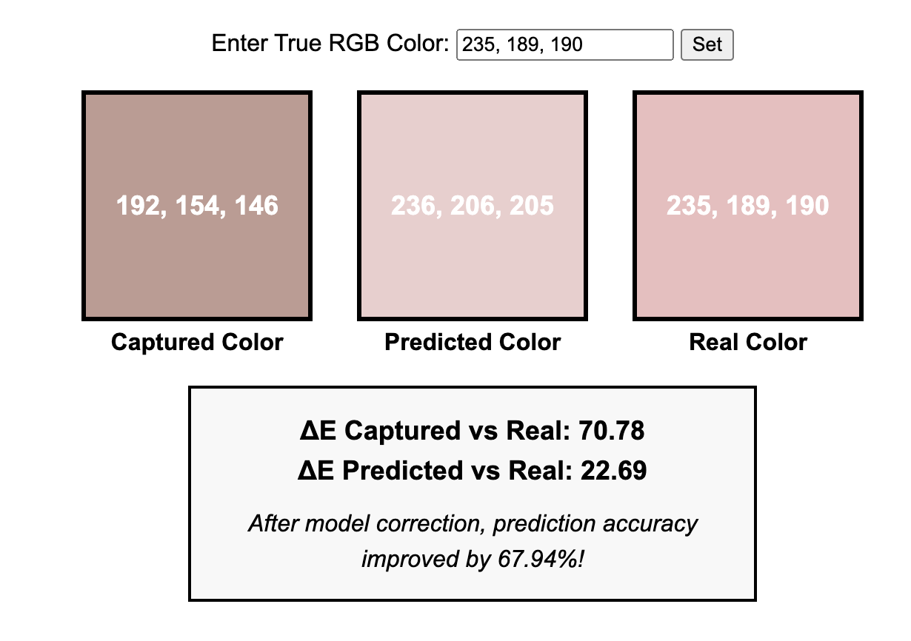
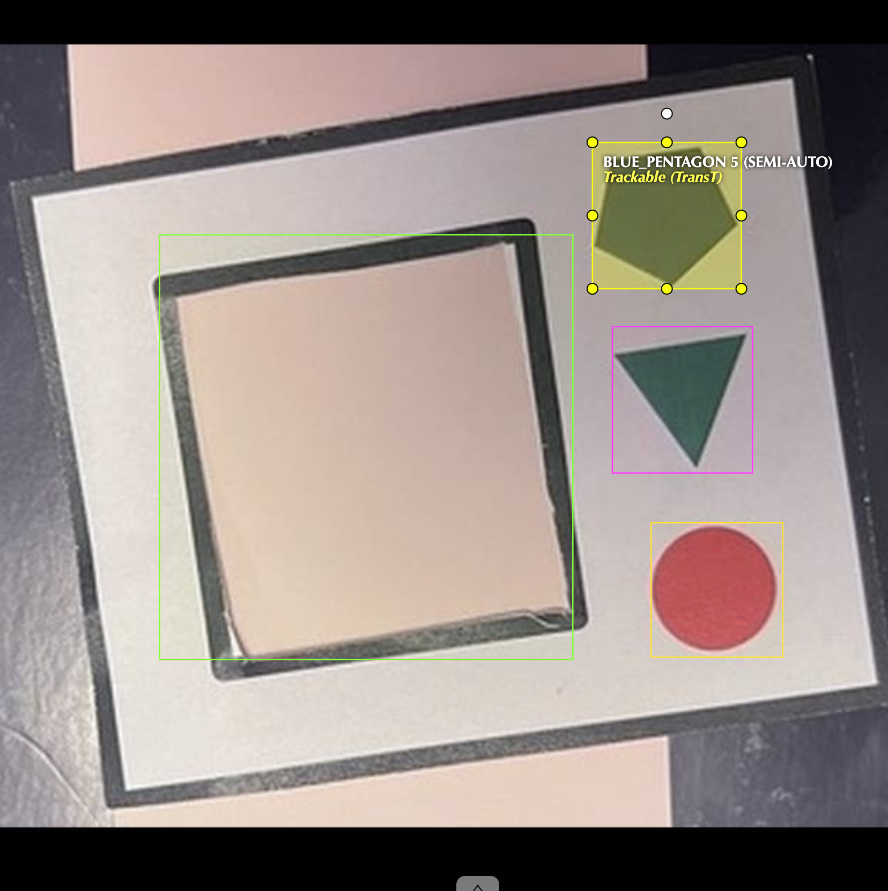
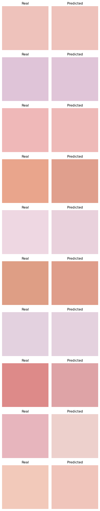
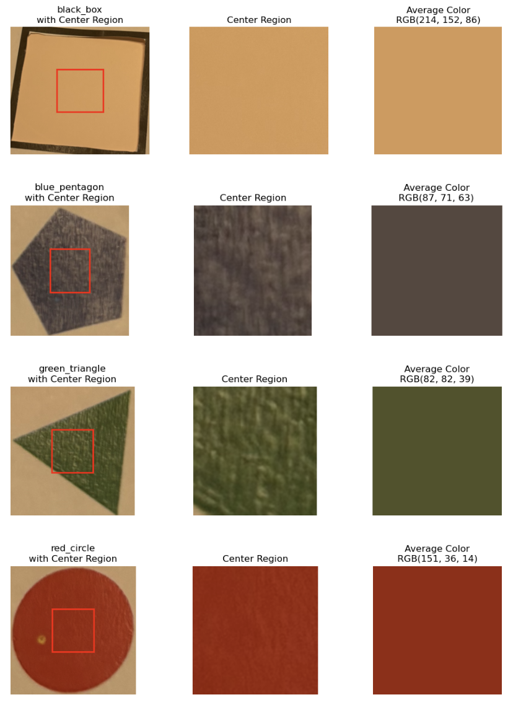
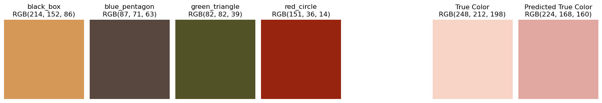

# Color Calibration in Machine Learning

---

## 1. Color Calibration Problem

The problem of color calibration is crucial in photography, industrial printing, and other image processing applications. Its primary goal is to map the colors captured by devices to a standard (or true) color space. This issue involves addressing color distortions under varying lighting conditions, mitigating noise effects, and achieving device-independent color reproduction.

### Literature Review

Numerous researchers have proposed various methods in this field, primarily including both linear and non-linear approaches:

- **Linear Methods and Constrained Least Squares Regression:**  
  Finlayson and Drew (1997) proposed a constrained least squares regression method that performs a linear transformation of the color space. This approach effectively mitigates the effects of noise and lighting variations while maintaining computational efficiency and achieving relatively accurate color calibration.

- **Polynomial Models:**  
  Hong et al. (2001) explored a digital camera colorimetric characterization method based on polynomial modeling. Their work demonstrated that polynomial transformations can effectively describe the mapping between captured colors and true colors, achieving favorable experimental results.

- **LUT-based End-to-End Calibration:**  
  Gatta et al. (2007) introduced a color calibration method based on 3D Look-Up Tables (3D LUTs). This approach converts the color calibration problem into a lookup problem and innovates in data acquisition and interpolation techniques, achieving an end-to-end color correction process.

- **Non-linear Methods and Deep Learning:**  
  Wei et al. (2019) and Shi & Healey (2002) investigated non-linear approaches and reflectance spectrum methods, respectively. They explored neural networks, non-linear polynomial models, and device-independent color recovery techniques based on reflectance spectra. These methods can capture higher-order interactions and complex non-linear relationships, offering more flexible solutions for color calibration.

From the literature, it is clear that each method has its own advantages and disadvantages. Linear methods are computationally simple and easy to interpret, while non-linear methods perform better when handling complex lighting conditions and noise interference. The objective of this research is to integrate these ideas and explore a color calibration model that combines matrix transformations with non-linear mappings, thereby improving calibration accuracy while ensuring feasibility for real-world engineering deployment.

---

## 2. Model

This section focuses on the model design, especially the modeling ideas involving mathematical formulas and matrix transformations. The core issue is to map the captured color data to standard color values, and common approaches include linear matrix transformations and general function mappings.

### Mathematical Model and Feature Construction

Consider the following four primary color quantities:

- **Captured Reference Colors:**  
  \( R_p, G_p, B_p \) — the RGB values of the reference patches (red, green, blue) captured by the camera.

- **Captured Target Color:**  
  \( C_p \) — the RGB value of the target patch captured by the camera.

- **Standard Reference Colors:**  

  $$
  R_s = (255, 0, 0), \quad
  G_s = (0, 255, 0), \quad
  B_s = (0, 0, 255).
  $$

- **True Target Color:**  
  \( C_s \) — the standard (true) RGB value of the target patch.

#### Matrix Transformation Method

Assuming that color calibration can be approximated as a linear mapping from captured colors to standard colors, we can write:

$$ (R_s, G_s, B_s, C_s)^T = M (R_p, G_p, B_p, C_p)^T $$

where M is a 4x4 transformation matrix learned from training data.

#### Non-linear Function Mapping

Considering that color distortions may exhibit non-linear characteristics, the following model can be adopted:

$$
(R_s, G_s, B_s, C_s) = f(R_p, G_p, B_p, C_p),
$$

or alternatively, model only the target patch:

$$
C_{\mathrm{real}} = f(R_p, G_p, B_p, C_p).
$$

#### Color Differences as Features

In practical applications, the difference between the captured reference colors and the standard colors is usually calculated. For example, for the red patch:

$$
\Delta_{RR,\text{red}} = R_{p,R} - 255, \quad
\Delta_{RG,\text{red}} = R_{p,G} - 0, \quad
\Delta_{RB,\text{red}} = R_{p,B} - 0.
$$

Similarly, differences for the green and blue patches are computed. These 9 differences, combined with the RGB values \((C_{p,R}, C_{p,G}, C_{p,B})\) of the target patch, form a 12-dimensional feature vector \(X\) as the input, with the output being the standard target color \(C_s\).

### Model Selection and Performance Comparison

In the experiments, **Linear Regression**, **Random Forest Regression**, **XGBoost**, and a **Small Neural Network (MLP)** were used to predict the target color, along with a baseline method (predicting using the training set mean). Under a 70% training / 30% testing data split, the performance metrics for each model are shown in the table below:

| Model               | \(R^2\)  | RMSE  | MAPE   | Mean \(\Delta E\) | Median \(\Delta E\) |
|---------------------|----------|-------|--------|-------------------|---------------------|
| Baseline            | -0.0037  | 31.55 | 14.98% | 14.61             | 13.84               |
| Linear Regression   | 0.7113   | 14.98 | 6.41%  | 20.87             | 6.63                |
| Random Forest       | 0.8225   | 12.10 | 4.33%  | 5.20              | 3.96                |
| XGBoost             | 0.8280   | 11.76 | 4.09%  | 5.14              | 3.95                |
| Small Neural Net    | 0.7068   | 14.22 | 5.92%  | 7.39              | 6.70                |

The experimental results indicate that **Random Forest** and **XGBoost** performed best on most metrics, particularly with an average \(\Delta E\) of approximately 5, which meets the basic requirements for commercial-grade color calibration.

#### Discussion on the Matrix Transformation Method

The matrix transformation method, by learning a linear mapping, offers advantages such as good model interpretability and computational efficiency. However, its performance may be limited when facing complex non-linear color distortions. In such cases, employing a non-linear function (e.g., neural networks or gradient boosting trees) can capture higher-order feature interactions, further enhancing calibration accuracy. Hyperparameter tuning (such as Bayesian optimization with cross-validation) can be used to achieve optimal model performance.

---

## 3. Practical Deployment (MLOps)

This section covers the practical engineering and deployment aspects of the project, detailing how the above models are applied within a complete color calibration system. For more specific details, please refer to the project code and deployment system.

### Data Processing and Feature Extraction

The entire data processing workflow includes:
- **Color Region Detection:** Use YOLO to detect the reference patches (such as *red_circle*, *green_triangle*, *blue_pentagon*, *black_box*) on the calibration card.
- **Color Extraction and Deviation Calculation:** Extract RGB values from the detection results and compute the deviation between the captured colors and the standard colors.
- **Data Augmentation:** Apply data augmentation techniques such as brightness adjustment, hue changes, gamma correction, motion blur, Gaussian blur, CLAHE, noise addition, and rotation to expand the number of samples from 250 to over 2000.

### Engineering Deployment and Cloud Operation

The complete system—including modules for detection, feature extraction, and model prediction—constitutes an end-to-end color calibration workflow. This system has been deployed on cloud platforms (such as Google Cloud) to achieve real-time color calibration. Specific deployment details include:
- A modular MLOps workflow that supports automated data processing and model updates.
- Utilizing cloud services to achieve large-scale concurrent processing and real-time response.

An illustration of the deployment is shown below:

### Model Generalization Testing

To validate the robustness of the model, testing was conducted on images captured under extreme lighting conditions (for example, under yellowish lighting). Although the directly captured color \(C_p\) exhibited a large error (e.g., \(\Delta E \approx 38.07\)), the color after model calibration \(C_{s,\text{pred}}\) showed significant improvement (e.g., \(\Delta E \approx 16.46\)), indicating potential areas for further optimization.

Related test images include:
- **Calibration Card (Printed Version):**

  

- **Edition Prepared for Printing:**

  

- **YOLO Detection Results:**

  

- **Model Training Results (Predicted vs. True Colors):**

  

- **Generalization Test Samples under Extreme Lighting:**

  

- **Comparison of Generalization Test Results:**

  

---

## References

1. Finlayson, G. D., & Drew, M. S. (1997). *Constrained least-squares regression in color spaces.* Journal of Electronic Imaging, 6(4), 484–493.  
   — Explores achieving color transformation through constrained least-squares regression, addressing noise and lighting variation issues.

2. Hong, G., Luo, M. R., & Rhodes, P. A. (2001). *A study of digital camera colorimetric characterisation based on polynomial modeling.* Color Research & Application, 26(1), 76–84.  
   — Analyzes using polynomial models to describe the mapping from camera RGB signals to true colors.

3. Gatta, C., et al. (2007). *A LUT-based approach for color correction in an end-to-end color imaging system.* CIC15: Fifteenth Color Imaging Conference, 327–330.  
   — Presents a 3D Look-Up Table (LUT)-based end-to-end color calibration method, covering data acquisition and interpolation techniques.

4. Wei, X., Luo, M. R., & Pointer, M. R. (2019). *Evaluation of some non-linear methods for camera color characterisation.* Color Research & Application, 44(2), 291–303.  
   — Evaluates various non-linear methods, including neural networks and non-linear polynomial models, for camera color calibration.

5. Shi, L., & Healey, G. (2002). *Using reflectance spectra to recover device-independent color.* Color Research & Application, 27(1), 50–59.  
   — Discusses how to use reflectance spectra to recover device-independent color representations.
