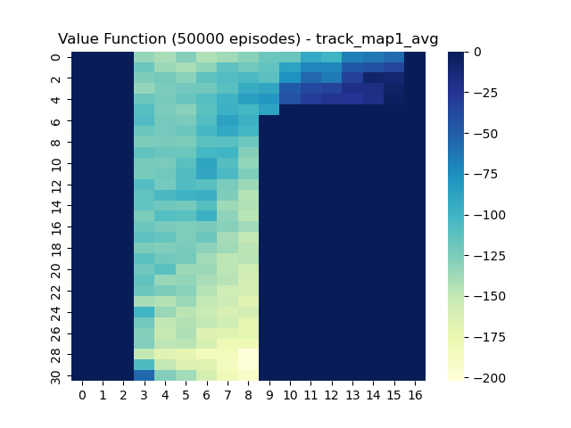

# A Racetrack Solution by Off-Policy Monte Carlo Control

## Introduction

This report discusses the implementation method for the Racetrack task from Exercise 5.12 in *Reinforcement Learning: An Introduction* (Sutton & Barto). The task requires us to drive a race car on a discretized racetrack, reaching the finish line in minimal time while avoiding track boundaries. For this purpose, we adopted the **Off-policy Monte Carlo Control** method to improve the policy and estimate the value function for the race car.

## Problem Description and Environment Setup

### Grid and Race Car States

The problem abstracts the racetrack as a discrete grid, where each grid cell can belong to the following types:
- `EDGE` (E): Track boundary, the race car is considered out of bounds if it reaches this area.
- `TRACK_LINE` (0): Track area, safe for driving.
- `START_LINE` (S): Starting line area, the race car's initial position is randomly selected from this area.
- `FINISH_LINE` (F): Finish line area, the episode ends when the race car crosses this.

The race car's state consists of position and velocity:

$$
S_t = \bigl(\text{position}=(r,c)\; \text{velocity}=(v_x, v_y)\bigr)
$$

Where the two velocity components $v_x, v_y$ are both limited to the interval $[0,\text{Vmax}]$, with $\text{Vmax} = 4$ in the code. Additionally, if acceleration adjustments cause velocity components to exceed this range, they need to be clamped to the legal range.

### Actions and Random Noise

In each time step, the race car can execute 9 types of actions $(a_x, a_y)$, where

$$
a_x, a_y \in \{(-1, 0, 1)\}
$$

This action represents adding $-1, 0, +1$ to the current velocity in the horizontal and vertical directions. According to the problem description, to increase difficulty, there is a 0.1 probability in each time step that the *acceleration* will be set to $(0,0)$, meaning that even if the intended action is to accelerate, it might fail, resulting in no velocity change for the race car.

### Reward Design

To encourage the race car to reach the finish line quickly and to penalize boundary violations and time delays, we set:

Where episode timeout refers to exceeding $\text{MAX\_STEPS\_PER\_EPISODE} = 10000$ steps, at which point the episode is forcibly ended.

## Off-Policy Monte Carlo Control Principles

### Target Policy and Behavior Policy

In off-policy control, we distinguish between the **target policy** $\pi$ and the **behavior policy** $b$:

- **Target policy** $\pi$: The policy we want to learn and evaluate, typically a *deterministic* greedy policy that takes the action with the maximum value in the action-value function $Q(s,a)$.
- **Behavior policy** $b$: The policy that actually generates data in the environment, which needs to ensure non-zero probability for all possible actions (coverage), common approaches include pure random policy or $\epsilon$-soft policy.

In this exercise, $\pi$ is a deterministic policy that is "greedy with respect to the current $Q$," while $b$ is chosen to be *purely random* (9 actions with equal probability), ensuring that all actions can be explored. This setup ensures sufficient exploration but may also lead to lower training efficiency, requiring more episodes to converge.

### Weighted Importance Sampling

Off-policy Monte Carlo methods rely on *importance sampling* to obtain unbiased estimates of the target policy's value. In this implementation, we used the weighted importance sampling method to reduce the variance of the estimate.

Let a trajectory be

$$
S_0, A_0, R_1, S_1, A_1, R_2, \ldots, S_{T-1}, A_{T-1}, R_T, S_T,
$$

Its probability under the behavior policy $b$ is

$$
P_b(\tau) = \prod_{t=0}^{T-1} b(A_t \mid S_t),
$$

While its probability under the target policy $\pi$ is

$$
P_\pi(\tau) = \prod_{t=0}^{T-1} \pi(A_t \mid S_t).
$$

For this trajectory, we define the *importance sampling ratio* as

$$
W_t = \prod_{k=0}^{t-1} \frac{\pi(A_k \mid S_k)}{b(A_k \mid S_k)}.
$$

In this experiment, $b$ randomly selects from 9 actions with uniform probability, i.e., $b(a \mid s) = \frac{1}{9}$, while $\pi$ has a probability of 1 for the unique optimal action and 0 for the rest, thus

This means that during backtracking, once we find that the action selected by the behavior policy does not match the target policy, the subsequent weights become 0, and we can directly `break` to end the backtracking.

### Value Function Update

In the Monte Carlo framework, we calculate returns after each trajectory ends. Since the discount factor $\gamma = 1.0$ in this problem, the return formula simplifies to:

$$
G_t = R_{t+1} + R_{t+2} + \cdots + R_T.
$$

The reasons for choosing $\gamma = 1.0$ are:

- The racetrack is an episodic task with a clear endpoint, so there's no issue with infinite accumulation.
- We want to minimize the total number of steps to reach the finish line, with each step having a $\text{REWARD\_MOVE} = -1$ penalty, so the total return is actually the negative of the number of steps (plus possible boundary violation penalties).
- Each decision on the track is equally important and should not favor short-term or long-term rewards; $\gamma = 1.0$ ensures no discounting of future rewards.

Then, we update $Q(S_t, A_t)$ using weighted importance sampling:

$$
Q(S_t, A_t) \leftarrow Q(S_t, A_t) + \frac{W_t}{C(S_t, A_t)} \bigl(G_t - Q(S_t, A_t)\bigr),
$$

where $C(S_t, A_t)$ accumulates weights to implement an adaptive step size:

$$
C(S_t, A_t) \leftarrow C(S_t, A_t) + W_t.
$$

This update method causes the learning rate to automatically decrease as the number of visits increases, contributing to the stable convergence of the algorithm.

## Experimental Results and Analysis

### Two Track Maps

We conducted experiments on two different track maps:

1. **track_map1**: A relatively simple L-shaped track with moderate width and a 90-degree turn.  
2. **track_map2**: A more complex S-shaped track with multiple curves and track segments of varying widths.

### Value Function Heatmap Analysis

After training for 50,000 episodes, we obtained value function heatmaps for both tracks, from which we can observe the following characteristics:

These heatmaps not only verify the convergence of the algorithm but also help us understand how the race car chooses optimal actions at different positions. In particular, we can observe:

- On straight sections, the value function is relatively smooth, and the race car tends to maintain high speed.
- Near curves, the value function shows significant changes, suggesting that the race car needs to slow down in advance.
- Near the finish line, the value function increases significantly, reflecting the expected reward for successfully completing the task.

### Trajectory Visualization and Analysis

Through trajectory visualization, we can intuitively see the performance of the learned policy during actual execution. From the generated trajectory plots, we observe:

By analyzing these trajectories, we found:

1. **track_map1**:
   - The race car can choose different routes based on the starting position, demonstrating the flexibility of the policy.
   - When approaching turns, the race car adjusts its route in advance to avoid boundary collisions.
   - When there are multiple feasible paths, the learned policy tends to choose the shortest or least risky path.

2. **track_map2**:
   - On larger tracks, the policy shows more obvious position adaptability, able to plan effective paths from different starting points to the finish.
   - Figure 7 shows a straight-line strategy, while Figure 8 shows a diagonal strategy, indicating that the algorithm can discover multiple effective ways to reach the finish line.
   - The learned policy can leverage track characteristics to maximize movement efficiency while ensuring safety.

By comparing trajectories from different starting positions, we can confirm that the algorithm has successfully learned flexible policies that adapt to different initial conditions, rather than just a single fixed route. This feature is crucial for robustness in practical applications.

### Algorithm Convergence and Parameter Sensitivity

Through experiments, we found that the off-policy Monte Carlo control algorithm shows good convergence on this problem, but we also observed some noteworthy characteristics:

1. **Training Cycles**: Although 50,000 episodes were set, the value function and policy had already basically stabilized after about 30,000 episodes, indicating that the algorithm converges relatively quickly on this task.

2. **Parameter Sensitivity**:
   - **Discount Factor (GAMMA)**: Set to 1.0, this is a key choice that makes the return directly equivalent to the cumulative reward sum, suitable for the race car problem with a clear terminal state. Since the reward for each movement step is -1, this actually makes the algorithm directly optimize the shortest path to the finish line. If a smaller GAMMA (e.g., 0.9) were set, the algorithm would focus more on near-term rewards and might choose suboptimal paths with higher early returns.
   - **Initial Value (INITIAL_VALUE)**: A pessimistic initial value of -150 helps encourage exploration; setting it too high might lead to excessive optimism, affecting convergence speed.
   - **Reward Design**: The ratio between boundary violation penalty (-100) and timeout penalty (-200) affects the policy's risk preference. The current setting makes the race car neither too risk-taking nor too conservative.

3. **Action Space Impact**: Limiting acceleration to the range $\{-1, 0, 1\}$ is reasonable, but it also means that the race car needs multiple steps to significantly change speed, thereby extending the time for policy learning.

## Conclusion

Through the off-policy Monte Carlo control algorithm, we successfully solved the racetrack problem, enabling the race car to learn an efficient driving policy from start to finish while avoiding collisions. The experimental results show that this method can converge to reasonable policies on tracks of different complexities, and through the visualization of value functions and trajectories, we can intuitively understand and verify the learning outcomes.

Although the purely random behavior policy is not ideal in terms of exploration efficiency, our implementation still achieved satisfactory results by combining weighted importance sampling and grid-by-grid checking techniques. This also demonstrates the effectiveness and flexibility of off-policy learning in complex control tasks.

## Comparison with MC ES

As additional work, I reproduced the solution for the Blackjack game using Monte Carlo methods as presented in the book. Blackjack (Twenty-one) is a classic reinforcement learning test problem with a large state space and strong randomness, making it very suitable for solving with Monte Carlo methods.

### Monte Carlo Method for Evaluating a Fixed Policy

First, I implemented a Monte Carlo evaluation of a deterministic policy in the code file `blackjack.py`. This implementation follows the method in Chapter 5 of the book, estimating the state value function through multiple samplings.

From the above figure, we can observe that when the player's hand total is higher (close to 21 points), the state value is significantly higher (yellow area), which is consistent with the rules and intuition of the game. At the same time, having a usable A (which can be counted as 1 or 11) results in an overall higher state value than having no usable A, which demonstrates the value of A's flexibility.

### Monte Carlo ES Method for Learning the Optimal Policy

Furthermore, based on the ideas from Example 5.3 in Chapter 5, I implemented the Monte Carlo Exploring Starts (ES) method in the `MC_ES.py` file to learn the optimal policy. This method has the following characteristics:

- Constructed an abstracted Blackjack environment (using an infinite deck)
- Completely relied on the Monte Carlo method to automatically learn the policy, without any "hard-coded" or "manually specified" policy rules
- Ensured sufficient access to all state-action pairs through Exploring Starts
- Naturally converged to the optimal policy after a sufficient number of training episodes

These learned policies are highly consistent with standard Blackjack optimal policies (such as basic strategy tables) and also match the results in the book, verifying the effectiveness of the Monte Carlo method in solving such problems.

### Comparison Analysis with the Racetrack Problem

Comparing the Blackjack problem with the Racetrack problem in the main body of this report, we can find some interesting commonalities and differences:

- **State Space**: The state space of Blackjack is relatively simple (player's total, dealer's visible card, whether there is a usable A), while the Racetrack problem's state space includes position and velocity, having a higher dimension.
- **Randomness**: Both problems include randomness; in Blackjack, it's the random drawing of cards, while in Racetrack, it's the 0.1 probability that acceleration might be set to zero.
- **Termination Conditions**: Both problems have clear termination conditions; for Blackjack, it's reaching 21 points, busting, or deciding to stick, and for Racetrack, it's reaching the finish line or going out of bounds.
- **Learning Methods**: Blackjack used the Monte Carlo ES (on-policy) method, while Racetrack used the off-policy Monte Carlo method. Each method has its advantages: the ES method is more efficient when the exploration space is smaller, while the off-policy method can better utilize existing experience in complex environments.

The solution processes for both problems demonstrate the powerful capability of Monte Carlo methods in solving Markov Decision Process (MDP) problems, especially in finding optimal or near-optimal policies through sampling and experience learning without needing precise knowledge of the environment's dynamic model.

### Summary and Reflection

Solving the Blackjack problem not only supplements the understanding of Monte Carlo methods but also provides a useful comparative reference for the Racetrack problem. These two problems represent different types of challenges in reinforcement learning:

- Blackjack is a relatively simple problem with randomness, emphasizing single-step decision risk management.
- Racetrack is a deterministic problem with a larger state space, emphasizing sequential decision-making and long-term planning.

Through the comparative study of these two problems, we can more comprehensively understand the application characteristics and advantages of Monte Carlo methods in different scenarios. In particular, Monte Carlo methods do not require modeling of environmental dynamics but learn directly from experience, a feature that makes them especially useful in complex or difficult-to-model environments.

## References

- Sutton, R. S., & Barto, A. G. (2018). *Reinforcement Learning: An Introduction* (2nd Edition).
- Precup, D., Sutton, R. S., & Singh, S. P. (2000). Eligibility Traces for Off-Policy Policy Evaluation. *ICML*.
- Rubinstein, R. Y., & Kroese, D. P. (2016). *Simulation and the Monte Carlo Method* (3rd Edition).
- Related instructions and hints for this course assignment.